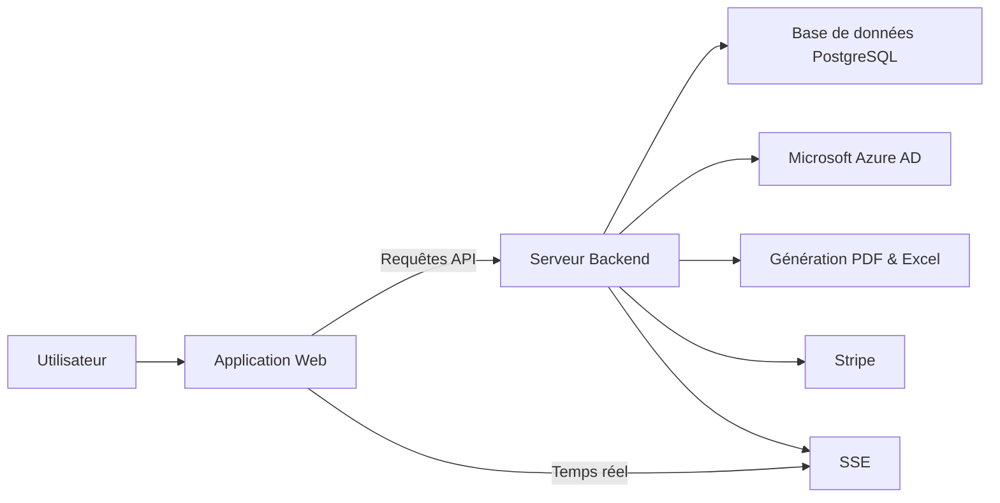
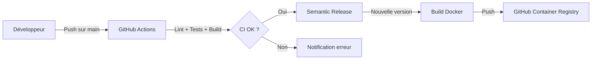

# CoproPilot

**Le logiciel de gestion de copropriété simple, moderne et 10x moins cher.**

[](LICENSE)

CoproPilot est une plateforme open-source de gestion de copropriété pour les syndics bénévoles et professionnels. Elle centralise la gestion des immeubles, des copropriétaires, de la comptabilité, des assemblées générales et de l'ensemble de la vie de la copropriété.

**Gratuit pour démarrer** · Sans engagement · Données hébergées en France

## Table des matières

- [À quoi sert ce produit ?](#à-quoi-sert-ce-produit-)
- [Fonctionnalités principales](#fonctionnalités-principales)
- [Sécurité, conformité & opérations](#sécurité-conformité--opérations)
- [Comment ça fonctionne](#comment-ça-fonctionne)
- [Environnements](#environnements)
- [Déploiement](#déploiement)
- [Stack technique](#stack-technique)
- [Démarrage rapide](#démarrage-rapide)
- [Variables d'environnement](#variables-denvironnement)
- [Contribuer](#contribuer)
- [Licence](#licence)
- [Documentation complémentaire](#documentation-complémentaire)

### Documentation technique

| Document | Description |
|----------|-------------|
| [Architecture](docs/architecture.md) | Vue d'ensemble des couches backend et frontend, déploiement Docker |
| [Modules fonctionnels](docs/modules.md) | Guide des 5 modules métier avec diagrammes de flux |
| [Schéma des données](docs/donnees.md) | Tables de la base de données et relations entre entités |
| [Référence API](docs/api.md) | Liste complète des 58+ points d'accès de l'API REST |
| [Authentification](docs/authentification.md) | Connexion email/mot de passe, rôles et sécurité |
| [Cycle annuel](docs/cycle-annuel.md) | 13 tâches réglementaires obligatoires et suivi de conformité |
| [Convocations AG](docs/convocations.md) | Processus de convocation en 4 étapes avec délai légal 21 jours |
| [Notifications](docs/notifications.md) | Système de notifications temps réel via SSE |
| [Exports](docs/exports.md) | Génération de 5 documents PDF et fichiers Excel |
| [Extranet copropriétaires](docs/extranet.md) | Espace en lecture seule pour les copropriétaires |
| [Gestion des utilisateurs](docs/user-management.md) | Création de comptes en masse et parcours de première connexion |
| [Conformité RGPD](docs/GDPR-COMPLIANCE-REVIEW.md) | Audit de conformité au Règlement Général sur la Protection des Données |
| [Stratégie open-core](docs/open-core-strategy.md) | Modèle AGPL-3.0, grille tarifaire et stratégie d'acquisition |
| [Roadmap disruptive](docs/disruptive-roadmap.md) | Roadmap 2026 : 4 piliers, 16 fonctionnalités, 10 sprints |
| [Base POWIMO](docs/legacy-knowledge-base.md) | Analyse de l'application legacy POWIMO (Square Habitat) |
| [Analyse fondations P1](docs/meeting-p1-analysis.md) | Décisions architecture event-driven et priorités sprint 1 |
| [Intégration Stripe](docs/stripe-integration.md) | Abonnements, facturation à l'usage et contrôle des quotas |
| [Événements de domaine](docs/domain-events.md) | EventBus, SSE temps réel et timeline des entités |
| [Système d'emails](docs/emails.md) | Emails transactionnels, templates et configuration SMTP |
| [Intégration Stripe](docs/stripe-integration.md) | Abonnements, facturation à l'usage et contrôle des quotas |
| [Événements de domaine](docs/domain-events.md) | EventBus, SSE temps réel et timeline des entités |
| [Système d'emails](docs/emails.md) | Emails transactionnels, templates et configuration SMTP |

## À quoi sert ce produit ?

- Centraliser la gestion de vos copropriétés dans un seul outil
- Administrer l'annuaire des copropriétaires, locataires et mutations
- Suivre la comptabilité : budgets, appels de fonds et comptabilité réglementaire (loi ALUR)
- Organiser vos assemblées générales avec résolutions, votes et feuilles de présence
- Déclarer et suivre les incidents, interventions et contrats de prestataires
- Gérer les documents, assurances, contentieux et obligations réglementaires
- Offrir un espace extranet aux copropriétaires pour consulter leurs documents
- Visualiser l'activité de votre parc immobilier via un tableau de bord
- Exporter vos données en PDF et Excel

## Fonctionnalités principales

- **Gestion des copropriétés** — Fiche complète de chaque immeuble avec lots, parties communes et clés de répartition
- **Annuaire copropriétaires** — Coordonnées, historique des mutations et lots associés
- **Gestion des locataires** — Suivi des occupants par lot avec dates d'entrée et de sortie
- **Comptabilité & charges** — Budgets prévisionnels, appels de fonds, suivi des paiements et fonds de travaux
- **Comptabilité réglementaire** — Journal, grand livre, balance et annexes conformes à la loi ALUR
- **Comptes bancaires** — Suivi des comptes et mouvements bancaires de chaque copropriété
- **Assemblées générales** — Planification, convocations, résolutions, votes et feuilles de présence
- **Conseil syndical** — Gestion des membres du conseil syndical
- **Travaux & incidents** — Déclaration d'incidents, suivi des interventions et carnet d'entretien
- **Contrats & prestataires** — Gestion des contrats fournisseurs et suivi des prestataires
- **Employés du syndicat** — Gestion du personnel du syndicat de copropriétaires
- **Assurances & sinistres** — Suivi des polices d'assurance et déclaration de sinistres
- **Contentieux & recouvrement** — Relances et procédures pour les impayés
- **Documents (GED)** — Gestion électronique des documents avec téléversement et téléchargement
- **Extranet copropriétaires** — Espace dédié en lecture seule avec accès selon le rôle
- **Règlement de copropriété** — Consultation et gestion du règlement
- **Immatriculation** — Déclarations au registre national des copropriétés
- **Contrat de syndic** — Gestion du mandat et mise en concurrence
- **Fiche synthétique** — Vue consolidée des informations clés de chaque copropriété
- **Cycle annuel** — Suivi des 13 tâches réglementaires obligatoires avec indicateur de conformité
- **Notifications temps réel** — Alertes via Server-Sent Events (SSE)
- **Exports** — Génération de documents PDF (PDFKit) et fichiers Excel (ExcelJS)
- **Tableau de bord** — Indicateurs clés, incidents récents et prochaines assemblées
- **Authentification sécurisée** — Connexion par email ou via Microsoft Azure AD (SSO)
- **Abonnements Stripe** — Gestion des plans tarifaires avec facturation à l'usage
- **Mode sombre** — Interface adaptable selon vos préférences visuelles

### Nouveautés métier (2026)

- **Messagerie & tickets** — Système de tickets complet avec fils de discussion (`/api/tickets`, frontend `/#/tickets`)
- **Annexes comptables AG** — Génération des 5 annexes obligatoires du décret 2005-240 (`/api/ag-reports/:coproprieteId/annexe/:numero`, pack complet PDF)
- **Vote électronique** — Votes et procurations en ligne (`/api/votes`, `/api/procurations`) avec règles de majorité (articles 24/25/26/unanimité) et limite légale de 3 procurations
- **Paiement en ligne copropriétaires** — Stripe Checkout (carte + SEPA) via `/api/extranet/payments/checkout`
- **Signature électronique** — Intégration Yousign (stub) via `/api/signatures` avec webhook
- **Workflow d'auto-relance** — `POST /api/coproprietes/:id/auto-relances` génère relances amiables et mises en demeure
- **Tableau de bord enrichi** — Nouveaux KPIs (`taux_recouvrement`, `impayes_evolution`, `incidents_par_statut`, `prochaines_echeances`) visualisés avec Recharts
- **Conformité loi ALUR** — `GET /api/coproprietes/:id/compliance` retourne le rapport de conformité

### Progressive Web App & composants réutilisables

- **PWA** — Manifeste et service worker avec cache API hors-ligne, invite d'installation, indicateur offline
- **Composants réutilisables** — `DataTable`, `ConfirmDialog`, `ErrorAlert`, `ErrorBoundary`, `Breadcrumbs`, `TabBar`, `NoCoproprieteSelected`
- **Code splitting** — Toutes les routes de pages utilisent `React.lazy`
- **Accessibilité** — `aria-label` sur tous les boutons d'action à icône seule

## Sécurité, conformité & opérations

### Sécurité & protection

- **Protection CSRF** — Middleware double-submit cookie (`apps/backend/src/middleware/csrf.js`)
- **Verrouillage de compte** — 5 tentatives de connexion échouées déclenchent un verrouillage de 15 minutes (`apps/backend/src/middleware/accountLockout.js`)
- **Corrélation des requêtes** — En-tête `X-Request-Id` injecté par `apps/backend/src/middleware/correlationId.js`
- **Validation d'entrée Zod** — Toutes les routes POST/PUT valident les corps de requête via `apps/backend/src/schemas/index.js`
- **Pagination standardisée** — Tous les endpoints de liste supportent `?page=1&limit=20&sortBy=created_at&sortOrder=desc` (`apps/backend/src/utils/pagination.js`)
- **API versionnée** — Routes disponibles à la fois sous `/api` et `/api/v1`
- **Health check enrichi** — `/api/health` renvoie l'état de connectivité et la latence de la base de données
- **Métriques Prometheus** — Endpoint `/metrics` (hors préfixe `/api`), protection optionnelle par bearer token via `METRICS_AUTH_TOKEN`

### Conformité & protection des données

- **Journal d'audit infalsifiable** — Chaîne de hachage SHA-256 ; vérification via `GET /api/audit/verify-chain` (admin uniquement)
- **Chiffrement PII** — Chiffrement AES-256-GCM opt-in des champs IBAN via `PII_ENCRYPTION_KEY` (générer une clé avec `node scripts/generate-encryption-key.js`)
- **RGPD** — Exports complets (Art. 20) et droit à l'effacement (Art. 17) via `GdprExportService` et `GdprErasureService`

### Opérations

- **Sauvegardes automatisées** — `scripts/backup.sh` (pg_dump compressé + rotation) et sidecar quotidien à 3 h du matin (`compose.backup.yml`)
- **Logs JSON structurés** — Winston diffuse en stdout au format JSON en production ; helper de log sampling dans `apps/backend/src/utils/logSampling.js`
- **Runbook** — `docs/operations.md` détaille backup/restore, logs, metrics et incident response

## Comment ça fonctionne



L'utilisateur accède à l'application web depuis son navigateur. L'application communique avec le serveur backend via une API REST. Le backend gère la logique métier, stocke les données dans PostgreSQL et délègue l'authentification à Better Auth (email/mot de passe ou Microsoft Azure AD). Il génère des documents PDF et Excel à la demande. Les mises à jour en temps réel sont transmises via SSE (Server-Sent Events). Stripe gère les abonnements et la facturation à l'usage.

En production, le backend sert aussi les fichiers statiques de l'application web.

## Environnements

| Environnement | URL | Description |
|---------------|-----|-------------|
| Développement (frontend) | `http://localhost:3000` | Serveur Vite local (proxy /api vers le backend) |
| Développement (backend) | `http://localhost:3001` | API Express locale |
| Production (Docker) | `http://localhost:3000` | Application complète conteneurisée |

## Déploiement



Le pipeline CI/CD (Intégration et Déploiement Continus) s'exécute via GitHub Actions à chaque push sur la branche principale. Il lance le lint, les tests et le build du frontend. Si tout réussit, Semantic Release détermine le numéro de version. Une image Docker multi-étapes est alors construite et publiée sur GitHub Container Registry (GHCR). Docker Compose orchestre l'application et la base de données PostgreSQL en production.

## Stack technique

- **Frontend :** React 19, TypeScript 5.7, TailwindCSS v4, Radix UI (shadcn/ui), React Query 5, Zustand 5, Recharts, Motion
- **Backend :** Node.js 24, Express 5, Knex.js 3 (query builder), Better Auth 1.4, Stripe, PDFKit, ExcelJS, Nodemailer
- **Base de données :** PostgreSQL 18 (33 migrations, 23 fichiers de seed)
- **Infrastructure :** Docker, Docker Compose, GitHub Actions, Semantic Release, GHCR

## Démarrage rapide

### Version cloud (recommandée)

Créez un compte gratuitement sur la plateforme hébergée — opérationnel en 5 minutes, sans installation.

### Auto-hébergement (développeurs)

```bash
git clone https://github.com/Wifsimster/copro-pilot.git
cd copro-pilot
docker compose -f compose.local.yml up -d
```

L'application est disponible sur `http://localhost:3000`. Voir [CONTRIBUTING.md](CONTRIBUTING.md) pour le setup de développement complet.

## Variables d'environnement

Les variables principales sont documentées dans `apps/backend/.env.example`. Les plus courantes :

| Variable | Description | Requis |
|---|---|---|
| `POSTGRES_URI` / `POSTGRES_*` | Connexion PostgreSQL | Oui |
| `BETTER_AUTH_SECRET` | Secret Better Auth | Oui |
| `BASE_URL` | URL du frontend (CORS + auth) | Oui |

Variables optionnelles liées aux nouvelles fonctionnalités :

| Variable | Description | Défaut |
|---|---|---|
| `PII_ENCRYPTION_KEY` | Clé AES-256-GCM pour chiffrer les IBAN (générer via `node scripts/generate-encryption-key.js`) | — (chiffrement désactivé) |
| `METRICS_AUTH_TOKEN` | Bearer token requis pour accéder à l'endpoint `/metrics` | — (endpoint public) |
| `YOUSIGN_API_KEY` | Clé API Yousign pour la signature électronique | — |
| `YOUSIGN_WEBHOOK_SECRET` | Secret de validation du webhook Yousign | — |

## Contribuer

Les contributions sont les bienvenues ! Consultez le guide [CONTRIBUTING.md](CONTRIBUTING.md) pour :
- Installer l'environnement de développement
- Comprendre les conventions de code et de commit
- Soumettre une Pull Request

## Licence

CoproPilot est distribué sous licence [AGPL-3.0](LICENSE). Vous êtes libre d'utiliser, modifier et distribuer ce logiciel, à condition que toute version modifiée hébergée publiquement soit également publiée sous AGPL-3.0.

## Documentation complémentaire

Une documentation technique détaillée est disponible dans le répertoire `docs/` (19 documents).

| Document | Description |
|---|---|
| [Architecture](docs/architecture.md) | Vue d'ensemble des couches backend et frontend, déploiement Docker |
| [Modules fonctionnels](docs/modules.md) | Guide des 5 modules métier avec diagrammes de flux |
| [Schéma des données](docs/donnees.md) | Tables de la base de données et relations entre entités |
| [Référence API](docs/api.md) | Liste complète des 58+ points d'accès de l'API REST |
| [Authentification](docs/authentification.md) | Connexion email/mot de passe, rôles et sécurité |
| [Cycle annuel](docs/cycle-annuel.md) | 13 tâches réglementaires obligatoires et suivi de conformité |
| [Convocations AG](docs/convocations.md) | Processus de convocation en 4 étapes avec délai légal 21 jours |
| [Notifications](docs/notifications.md) | Système de notifications temps réel via SSE |
| [Exports](docs/exports.md) | Génération de 5 documents PDF et fichiers Excel |
| [Extranet copropriétaires](docs/extranet.md) | Espace en lecture seule pour les copropriétaires |
| [Gestion des utilisateurs](docs/user-management.md) | Création de comptes en masse et parcours de première connexion |
| [Conformité RGPD](docs/GDPR-COMPLIANCE-REVIEW.md) | Audit de conformité au Règlement Général sur la Protection des Données |
| [Stratégie open-core](docs/open-core-strategy.md) | Modèle AGPL-3.0, grille tarifaire et stratégie d'acquisition |
| [Roadmap disruptive](docs/disruptive-roadmap.md) | Roadmap 2026 : 4 piliers, 16 fonctionnalités, 10 sprints |
| [Base POWIMO](docs/legacy-knowledge-base.md) | Analyse de l'application legacy POWIMO (Square Habitat) |
| [Analyse fondations P1](docs/meeting-p1-analysis.md) | Décisions architecture event-driven et priorités sprint 1 |
| [Intégration Stripe](docs/stripe-integration.md) | Abonnements, facturation à l'usage et contrôle des quotas |
| [Événements de domaine](docs/domain-events.md) | EventBus, SSE temps réel et timeline des entités |
| [Système d'emails](docs/emails.md) | Emails transactionnels, templates et configuration SMTP |
