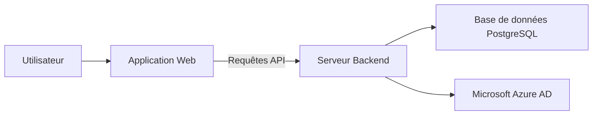
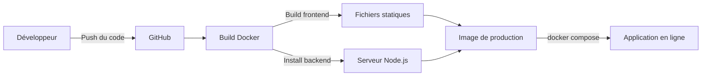

# ImmoIA

Plateforme de gestion de copropriété conçue pour les syndics professionnels. Elle centralise la gestion des immeubles, des copropriétaires, des charges, des assemblées générales et des travaux.

## Table des matières

- [À quoi sert ce produit ?](#à-quoi-sert-ce-produit-)
- [Fonctionnalités principales](#fonctionnalités-principales)
- [Comment ça fonctionne](#comment-ça-fonctionne)
- [Environnements](#environnements)
- [Déploiement](#déploiement)
- [Stack technique](#stack-technique)

## À quoi sert ce produit ?

- Gérer vos copropriétés et leurs lots (appartements, caves, parkings, etc.)
- Administrer l'annuaire des copropriétaires et locataires
- Suivre la comptabilité : budgets prévisionnels, appels de fonds, paiements
- Organiser les assemblées générales avec gestion des résolutions et votes
- Déclarer et suivre les incidents et interventions de maintenance

## Fonctionnalités principales

- **Gestion des copropriétés** — Fiche complète de chaque immeuble avec ses lots, parties communes et clés de répartition
- **Annuaire copropriétaires** — Coordonnées, historique des mutations et lots associés
- **Gestion des locataires** — Suivi des occupants par lot avec dates d'entrée et de sortie
- **Comptabilité & charges** — Budgets prévisionnels, appels de fonds trimestriels, suivi des paiements et fonds de travaux
- **Assemblées générales** — Planification, convocations, résolutions, votes et feuilles de présence
- **Travaux & incidents** — Déclaration d'incidents, suivi des interventions et carnet d'entretien
- **Authentification sécurisée** — Connexion via Microsoft Azure AD (SSO)
- **Mode sombre** — Interface adaptable selon vos préférences visuelles
- **Tableau de bord** — Vue d'ensemble avec indicateurs clés

## Comment ça fonctionne

L'utilisateur accède à l'application web depuis son navigateur. L'application communique avec le serveur backend via une API REST. Le backend gère la logique métier, stocke les données dans PostgreSQL et délègue l'authentification à Microsoft Azure AD.

En production, le backend sert aussi les fichiers statiques de l'application web.

## Environnements

| Environnement | URL | Description |
|---------------|-----|-------------|
| Développement (frontend) | `http://localhost:5173` | Serveur Vite local |
| Développement (backend) | `http://localhost:3001` | API Express locale |
| Production (Docker) | `http://localhost:3000` | Application complète conteneurisée |

## Déploiement

Le déploiement repose sur Docker. Le Dockerfile effectue un build multi-étapes : il compile le frontend en fichiers statiques, puis construit l'image de production contenant le backend Node.js et les fichiers compilés du frontend. Docker Compose orchestre l'application et la base de données PostgreSQL.

## Stack technique

- **Frontend :** React 19, TypeScript, TailwindCSS v4, Radix UI, React Query, Zustand, Recharts
- **Backend :** Node.js 24, Express 5, Knex.js (query builder), Better Auth
- **Base de données :** PostgreSQL 18
- **Infrastructure :** Docker, Docker Compose
- **Qualité de code :** ESLint, Prettier
