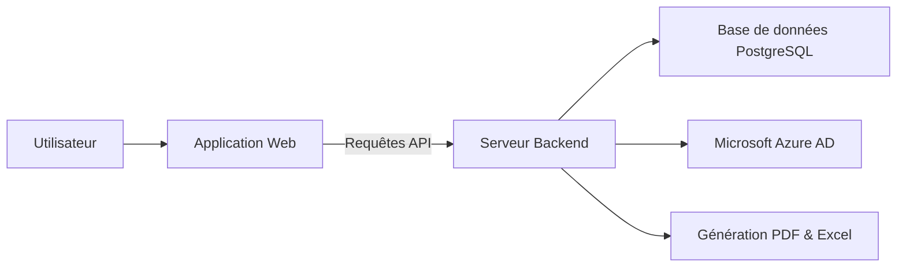
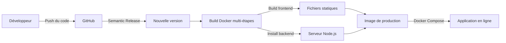

# CoproPilot

Plateforme de gestion de copropriété conçue pour les syndics professionnels. Elle centralise la gestion des immeubles, des copropriétaires, de la comptabilité, des assemblées générales et de l'ensemble de la vie de la copropriété.

## Table des matières

- [À quoi sert ce produit ?](#à-quoi-sert-ce-produit-)
- [Fonctionnalités principales](#fonctionnalités-principales)
- [Comment ça fonctionne](#comment-ça-fonctionne)
- [Environnements](#environnements)
- [Déploiement](#déploiement)
- [Stack technique](#stack-technique)
- [Documentation complémentaire](#documentation-complémentaire)

### Documentation technique

| Document | Description |
|----------|-------------|
| [Architecture](docs/architecture.md) | Vue d'ensemble de l'architecture, couches backend et frontend, déploiement Docker |
| [Modules fonctionnels](docs/modules.md) | Guide des modules métier avec diagrammes de flux |
| [Schéma des données](docs/donnees.md) | Description des tables de la base de données et de leurs relations |
| [Référence API](docs/api.md) | Liste complète des points d'accès de l'API REST |
| [Authentification](docs/authentification.md) | Mécanismes de connexion, rôles et protection des données |

## À quoi sert ce produit ?

- Centraliser la gestion de vos copropriétés dans un seul outil
- Administrer l'annuaire des copropriétaires, locataires et mutations
- Suivre la comptabilité : budgets, appels de fonds, paiements et comptabilité réglementaire (loi ALUR)
- Organiser vos assemblées générales avec résolutions, votes et feuilles de présence
- Déclarer et suivre les incidents, interventions et contrats de prestataires
- Gérer les documents, assurances, contentieux et obligations réglementaires
- Offrir un espace extranet aux copropriétaires pour consulter leurs documents
- Visualiser l'activité de votre parc immobilier via un tableau de bord
- Exporter vos données en PDF et Excel

## Fonctionnalités principales

- **Gestion des copropriétés** — Fiche complète de chaque immeuble avec lots, parties communes et clés de répartition
- **Annuaire copropriétaires** — Coordonnées, historique des mutations et lots associés
- **Gestion des locataires** — Suivi des occupants par lot avec dates d'entrée et de sortie
- **Comptabilité & charges** — Budgets prévisionnels, appels de fonds, suivi des paiements et fonds de travaux
- **Comptabilité réglementaire** — Journal, grand livre, balance et annexes conformes à la loi ALUR
- **Comptes bancaires** — Suivi des comptes et mouvements bancaires de chaque copropriété
- **Assemblées générales** — Planification, convocations, résolutions, votes et feuilles de présence
- **Conseil syndical** — Gestion des membres du conseil syndical
- **Travaux & incidents** — Déclaration d'incidents, suivi des interventions et carnet d'entretien
- **Contrats & prestataires** — Gestion des contrats fournisseurs et suivi des prestataires
- **Employés du syndicat** — Gestion du personnel du syndicat de copropriétaires
- **Assurances & sinistres** — Suivi des polices d'assurance et déclaration de sinistres
- **Contentieux & recouvrement** — Relances et procédures pour les impayés
- **Documents (GED)** — Gestion électronique des documents avec téléversement et téléchargement
- **Extranet copropriétaires** — Espace dédié avec accès aux documents selon le rôle
- **Règlement de copropriété** — Consultation et gestion du règlement
- **Immatriculation** — Déclarations au registre national des copropriétés
- **Contrat de syndic** — Gestion du mandat et mise en concurrence
- **Fiche synthétique** — Vue consolidée des informations clés de chaque copropriété
- **Notifications** — Alertes et suivi des événements importants
- **Exports** — Génération de documents PDF et fichiers Excel
- **Tableau de bord** — Indicateurs clés, incidents récents et prochaines assemblées
- **Authentification sécurisée** — Connexion par email ou via Microsoft Azure AD (SSO)
- **Mode sombre** — Interface adaptable selon vos préférences visuelles

## Comment ça fonctionne

L'utilisateur accède à l'application web depuis son navigateur. L'application communique avec le serveur backend via une API REST. Le backend gère la logique métier, stocke les données dans PostgreSQL et délègue l'authentification à Microsoft Azure AD. Il génère également des documents PDF et Excel à la demande.

En production, le backend sert aussi les fichiers statiques de l'application web.

## Environnements

| Environnement | URL | Description |
|---------------|-----|-------------|
| Développement (frontend) | `http://localhost:5173` | Serveur Vite local |
| Développement (backend) | `http://localhost:3001` | API Express locale |
| Production (Docker) | `http://localhost:3000` | Application complète conteneurisée |

## Déploiement

Le déploiement repose sur Docker. Semantic Release génère automatiquement les versions à chaque push. Le Dockerfile effectue un build multi-étapes : il compile le frontend en fichiers statiques, puis construit l'image de production. Docker Compose orchestre l'application et la base de données PostgreSQL.

## Stack technique

- **Frontend :** React 19, TypeScript, TailwindCSS v4, Radix UI, React Query, Zustand, Recharts, Motion
- **Backend :** Node.js 24, Express 5, Knex.js (query builder), Better Auth, PDFKit, ExcelJS
- **Base de données :** PostgreSQL 18
- **Infrastructure :** Docker, Docker Compose, Semantic Release

## Documentation complémentaire

Une documentation technique détaillée est disponible dans le répertoire `docs/`.

| Document | Description |
|---|---|
| [Architecture](docs/architecture.md) | Vue d'ensemble de l'architecture, couches backend et frontend, déploiement Docker |
| [Modules fonctionnels](docs/modules.md) | Guide des modules métier avec diagrammes de flux |
| [Schéma des données](docs/donnees.md) | Description des tables de la base de données et de leurs relations |
| [Référence API](docs/api.md) | Liste complète des points d'accès de l'API REST |
| [Authentification](docs/authentification.md) | Mécanismes de connexion, rôles et protection des données |
