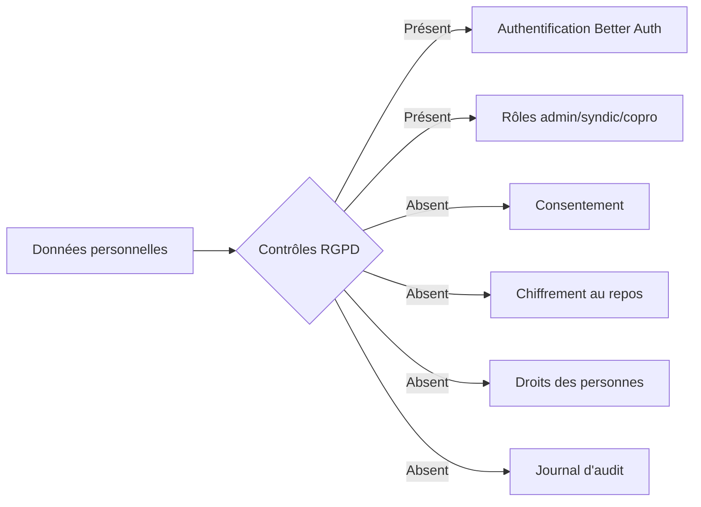

# Audit de conformité RGPD — CoproPilot

Ce document évalue la conformité de CoproPilot au RGPD (Règlement Général sur la Protection des Données). Il identifie les écarts et propose un plan de remédiation priorisé.

> **Date :** 2026-02-19 | **Périmètre :** Backend Express + Frontend React + PostgreSQL
> **Note :** Ce document est un audit technique, pas un avis juridique. Consulter un juriste RGPD.

## Résumé

- **Note de conformité : ~25% — NON CONFORME**
- **Risque : ÉLEVÉ** — L'application traite des données personnelles sensibles sans les contrôles RGPD fondamentaux
- CoproPilot stocke noms, emails, téléphones, IBAN, salaires, dossiers juridiques et historiques financiers
- Il manque le consentement, le chiffrement au repos, les droits des personnes et les journaux d'audit

## Inventaire des données personnelles

| Table | Données sensibles | Criticité |
|-------|------------------|-----------|
| `user` | nom, email, prénom, nom de famille, image | Critique |
| `session` | jeton, adresse IP, user agent | Critique |
| `account` | mot de passe (hashé), jetons d'accès | Critique |
| `coproprietaires` | nom, prénom, email, téléphone, adresse, notes | Critique |
| `comptes_bancaires` | **IBAN**, BIC, banque, solde | Critique |
| `employes_syndicat` | nom, poste, contrat, **salaire brut** | Critique |
| `procedures` | avocat, tribunal, référence, décision, montant | Critique |
| `relances` | montant dû, historique d'impayés | Critique |
| `paiements` | montant, date, mode, référence | Élevé |
| `locataires` | nom, prénom, email, téléphone | Élevé |
| `prestataires` | contact, email, téléphone, SIRET | Élevé |
| `mutations` | noms ancien/nouveau propriétaire | Élevé |
| `mouvements_bancaires` | montant, date, libellé | Élevé |

**Constat :** 20+ tables stockent des données personnelles **sans chiffrement au repos**. Les IBAN, salaires et dossiers juridiques sont en clair.

## Conformité article par article

| Article | Exigence | Statut | Commentaire |
|---------|----------|--------|-------------|
| **Art. 5(1)(a)** | Licéité, loyauté, transparence | Non conforme | Pas de politique de confidentialité |
| **Art. 5(1)(b)** | Limitation des finalités | Non conforme | Finalités non documentées |
| **Art. 5(1)(e)** | Limitation de conservation | Non conforme | Pas de politique de rétention |
| **Art. 5(1)(f)** | Intégrité et confidentialité | Non conforme | Pas de chiffrement, headers manquants |
| **Art. 5(2)** | Responsabilité | Non conforme | Pas d'audit trail, pas de DPIA |
| **Art. 6** | Base légale | Non conforme | Pas de consentement documenté |
| **Art. 7** | Conditions du consentement | Non conforme | Pas de mécanisme de consentement |
| **Art. 15** | Droit d'accès | Partiel | Extranet montre certaines données |
| **Art. 16** | Droit de rectification | Non conforme | Profils en lecture seule |
| **Art. 17** | Droit à l'effacement | Non conforme | Pas de suppression self-service |
| **Art. 20** | Droit à la portabilité | Non conforme | Pas d'export de données personnelles |
| **Art. 25** | Protection dès la conception | Non conforme | Pas de privacy-by-design |
| **Art. 32** | Sécurité du traitement | Partiel | Auth présente, chiffrement/headers absents |
| **Art. 33** | Notification de violation | Non conforme | Pas de détection de violation |
| **Art. 35** | Analyse d'impact (DPIA) | Non conforme | Pas de DPIA réalisée |

## Problèmes identifiés par domaine

### Authentification et sessions

**Points positifs :** Better Auth gère le hashage des mots de passe. Le logger masque les mots de passe dans les requêtes.

**Problèmes :**

| Problème | Sévérité |
|----------|----------|
| Pas de timeout de session explicite | Élevé |
| Flags cookie non configurés (`secure`, `httpOnly`, `sameSite`) | Élevé |
| Adresse IP et user agent stockés sans consentement | Moyen |
| Validation de mot de passe uniquement côté frontend | Moyen |

### Consentement

**Statut : non implémenté.** Pas de case à cocher, pas de table de consentement, pas de retrait possible, pas de bandeau cookies, pas de page politique de confidentialité.

### Droits des personnes concernées

| Droit | Statut | Détail |
|-------|--------|--------|
| Accès (Art. 15) | Partiel | Extranet montre soldes et charges, mais pas de vue consolidée |
| Rectification (Art. 16) | Absent | Profils en lecture seule, seul l'admin peut modifier |
| Effacement (Art. 17) | Non conforme | Suppression en dur, pas de workflow de demande, cascade financière |
| Portabilité (Art. 20) | Absent | Exports existants pour rapports métier, pas pour données personnelles |
| Opposition (Art. 21) | Absent | Pas de mécanisme d'opposition |

### Journaux et fuites de données personnelles

| Problème | Sévérité |
|----------|----------|
| Adresse IP loguée sur chaque requête | Élevé |
| Email utilisateur logué dans les warnings d'authentification | Élevé |
| Masquage limité à 4 champs (password, token, apikey, secret) | Moyen |
| Headers d'autorisation non masqués | Moyen |

### Sécurité

| Contrôle | Statut |
|----------|--------|
| Headers de sécurité (HSTS, CSP, X-Frame-Options) | Absent |
| Rate limiting (anti brute-force) | Absent |
| Chiffrement des champs sensibles (IBAN, salaires) | Absent |
| Chiffrement de la base au repos | Non configuré |
| Journalisation d'audit (qui a accédé à quoi) | Absent |
| Détection de violation de données | Absent |

### Stockage côté client

| Problème | Sévérité |
|----------|----------|
| Objet utilisateur complet dans `localStorage` (clair) | Élevé |
| Email stocké séparément dans `localStorage` (redondant) | Élevé |
| `localStorage` persiste même après fermeture de l'onglet | Moyen |
| Vulnérable aux attaques XSS | Élevé |

### Rétention des données

**Statut : pas de politique de rétention.** Sessions conservées indéfiniment. La suppression en cascade détruit les paiements, ce qui viole la loi comptable française (conservation 6 à 10 ans).

## Plan de remédiation

### Phase 1 — Urgent (sprint immédiat)

| Action | Effort |
|--------|--------|
| Installer `helmet.js` (headers de sécurité) | 1h |
| Configurer les flags cookies (`secure`, `httpOnly`, `sameSite`) | 1h |
| Ajouter `express-rate-limit` sur les routes d'authentification | 2h |
| Supprimer les adresses IP des logs de requêtes | 1h |
| Migrer les données utilisateur de `localStorage` vers `sessionStorage` | 2h |
| Ajouter `requireAdmin()` sur toutes les routes DELETE | 3h |

### Phase 2 — Prioritaire (court terme)

| Action | Effort |
|--------|--------|
| Créer une page politique de confidentialité | 1j |
| Ajouter un système de consentement (case + table `consent_records`) | 2j |
| Permettre la rectification du profil en self-service | 2j |
| Ajouter l'export de données personnelles (JSON) | 1j |
| Implémenter le soft-delete avec audit trail | 3j |
| Chiffrer les champs sensibles (IBAN, salaire) | 2j |

### Phase 3 — Moyen terme

| Action | Effort |
|--------|--------|
| Définir et appliquer une politique de rétention des données | 3j |
| Mettre en place un journal d'audit complet et inviolable | 3j |
| Implémenter un workflow de demande de suppression (délai 30j) | 2j |
| Ajouter un bandeau de consentement cookies | 1j |
| Configurer un timeout de session (8h recommandé) | 1j |

### Phase 4 — Long terme

| Action | Effort |
|--------|--------|
| Réaliser une analyse d'impact (DPIA) | 1 sem |
| Documenter le registre des traitements (Art. 30) | 1 sem |
| Établir des DPA avec les sous-traitants (Better Auth, hébergeur) | 1 sem |
| Mettre en place la détection et notification de violation (72h CNIL) | 2 sem |
| Évaluer la nécessité d'un DPO | — |

## Contexte légal français

CoproPilot opère dans le domaine de la gestion de copropriété en France :

- **Loi comptable :** Conservation des documents financiers 6 à 10 ans
- **Loi ALUR / Loi Élan :** Obligations du syndic pour la conservation des documents
- **CNIL :** Autorité française de protection des données, applique le RGPD
- **Effacement vs rétention :** Les données financières ne peuvent pas être supprimées mais doivent être anonymisées après la période de conservation

Ces obligations légales constituent une base licite (Art. 6(1)(c)) pour conserver certaines données. Cela doit être documenté et communiqué aux personnes concernées.

---

*Cet audit est basé sur une analyse du code au 2026-02-19. Il ne constitue pas un avis juridique.*
