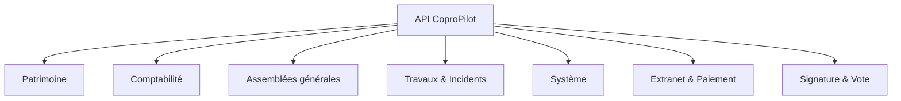

# Référence API

Ce document répertorie tous les points d'accès de l'API (Interface de Programmation Applicative) de CoproPilot. Toutes les requêtes sont préfixées par `/api`.

## Structure de l'API



L'API est organisée en plusieurs groupes correspondant aux modules fonctionnels de la plateforme.

## Conventions REST

L'API suit les conventions REST (Representational State Transfer) :

- **GET** — Consulter une ou plusieurs ressources.
- **POST** — Créer une nouvelle ressource.
- **PUT** — Modifier une ressource existante.
- **DELETE** — Supprimer une ressource.

Toutes les routes (sauf santé, métriques et webhooks signés) nécessitent une authentification préalable.

## Versioning de l'API

Toutes les routes de l'API sont exposées simultanément sous deux préfixes équivalents :

- `/api/*` — préfixe historique (rétrocompatible).
- `/api/v1/*` — préfixe versionné (recommandé pour les nouvelles intégrations).

Les deux préfixes pointent vers la même base de code. Lorsqu'une version `v2` sera introduite, `/api/*` continuera de servir la `v1` pour éviter les régressions.

Exemple :

```http
GET /api/v1/coproprietes
GET /api/coproprietes     # équivalent
```

## Pagination

Les endpoints de listing acceptent désormais des paramètres de requête optionnels pour la pagination et le tri :

| Paramètre | Type | Défaut | Description |
|---|---|---|---|
| `page` | entier | `1` | Numéro de page (commence à 1). |
| `limit` | entier | `20` | Nombre d'éléments par page (max recommandé : 100). |
| `sortBy` | chaîne | `created_at` | Nom de colonne sur laquelle trier. |
| `sortOrder` | `asc` \| `desc` | `desc` | Sens de tri. |

Lorsqu'au moins un de ces paramètres est fourni, la réponse prend la forme paginée suivante :

```json
{
  "data": [ /* ... */ ],
  "pagination": {
    "page": 1,
    "limit": 20,
    "total": 147,
    "totalPages": 8
  }
}
```

Sans paramètre de pagination, les endpoints retournent l'intégralité des résultats (structure historique) pour rester rétrocompatibles.

**Endpoints supportant la pagination :**

- `GET /api/coproprietes`
- `GET /api/coproprietaires`
- `GET /api/lots`
- `GET /api/incidents`
- `GET /api/documents`
- `GET /api/contrats`
- `GET /api/paiements`

Exemple :

```http
GET /api/coproprietes?page=2&limit=25&sortBy=nom&sortOrder=asc
```

## Sécurité

### Protection CSRF (double-submit cookie)

Toutes les requêtes mutant l'état (`POST`, `PUT`, `PATCH`, `DELETE`) doivent présenter un jeton CSRF :

1. Effectuer une première requête `GET` afin que le serveur positionne le cookie `csrf-token` (non-HttpOnly).
2. Lire la valeur du cookie côté client.
3. La renvoyer dans l'en-tête `X-CSRF-Token` de toute requête mutante.

Le serveur vérifie que l'en-tête `X-CSRF-Token` est identique à la valeur du cookie `csrf-token`. En cas d'absence ou de divergence, la réponse est `403 Forbidden` avec `{ "error": "CSRF token missing" }` ou `{ "error": "CSRF token mismatch" }`.

**Routes exemptées de la protection CSRF :**

- `/api/auth/*` — Better Auth gère sa propre sécurité.
- `/api/stripe/webhook` — vérifié par signature Stripe.
- `/api/signatures/webhook` — vérifié par HMAC Yousign.

### Verrouillage de compte

Après **5 tentatives de connexion échouées** sur `/api/auth/sign-in/email` pour une même adresse e-mail, le compte est temporairement verrouillé pendant **15 minutes**. Les requêtes suivantes renvoient :

```http
HTTP/1.1 429 Too Many Requests
Retry-After: 900
```

```json
{
  "error": "Compte temporairement verrouille",
  "message": "Trop de tentatives de connexion echouees. Reessayez dans 15 minute(s)."
}
```

Un login réussi avant le verrouillage réinitialise le compteur.

### Identifiant de corrélation (`X-Request-Id`)

Chaque requête est associée à un identifiant de corrélation :

- Si l'appelant envoie un en-tête `X-Request-Id`, celui-ci est conservé.
- Sinon, le serveur génère un UUID v4.

L'identifiant est renvoyé dans tous les cas dans l'en-tête de réponse `X-Request-Id` et figure dans les logs du backend. Il permet de tracer une requête utilisateur de bout en bout (frontend → logs backend → incident).

### Validation d'entrée (HTTP 422)

Les routes `POST` / `PUT` soumises à validation (Zod) renvoient une réponse structurée en cas d'échec :

```http
HTTP/1.1 422 Unprocessable Entity
```

```json
{
  "error": "Validation failed",
  "details": [
    { "field": "nom", "message": "Requis" },
    { "field": "adresse", "message": "String must contain at least 5 character(s)" }
  ]
}
```

Chaque entrée de `details` identifie précisément le champ fautif et un message lisible.

---

## Système

| Action | Méthode | Chemin |
|---|---|---|
| Vérifier l'état du serveur | GET | `/api/health` |
| Récupérer les statistiques du tableau de bord | GET | `/api/stats/dashboard` |
| Exposer les métriques Prometheus | GET | `/metrics` (hors `/api`) |
| Vérifier l'intégrité de la chaîne d'audit | GET | `/api/audit/verify-chain` |

### `GET /api/health`

Endpoint de healthcheck enrichi. Ne nécessite pas d'authentification.

**Réponse `200 OK` :**

```json
{
  "status": "ok",
  "uptime": 12345.67,
  "version": "1.10.0",
  "timestamp": "2026-04-13T10:00:00.000Z",
  "database": {
    "connected": true,
    "latency_ms": 1.83
  }
}
```

En cas d'échec de la base de données, la réponse est `503 Service Unavailable` avec `status: "error"` et, si disponible, `database.error`.

### `GET /metrics`

Expose les métriques Prometheus du backend (compteurs HTTP, durées, pools DB, etc.). **Attention : monté à la racine et non sous `/api`**.

- Par défaut, non authentifié (à réserver à un réseau privé).
- Si la variable d'environnement `METRICS_AUTH_TOKEN` est définie, l'endpoint exige un en-tête `Authorization: Bearer <token>` ; toute requête sans ou avec mauvais jeton retourne `401 Unauthorized` avec l'en-tête `WWW-Authenticate: Bearer realm="metrics"`.
- Type de contenu : `text/plain; version=0.0.4` (format d'exposition Prometheus).

### `GET /api/audit/verify-chain`

Endpoint **réservé aux administrateurs** (`requireAdmin`). Parcourt la totalité de la table `audit_log` et vérifie que le hash de chaque entrée correspond à son contenu canonique et référence correctement son prédécesseur.

**Réponse `200 OK` — chaîne intègre :**

```json
{
  "valid": true,
  "total_entries": 24511
}
```

**Réponse `500 Internal Server Error` — altération détectée :**

```json
{
  "valid": false,
  "brokenAt": 17342,
  "message": "Hash mismatch at entry 17342",
  "total_entries": 24511
}
```

---

## Patrimoine — Copropriétés

| Action | Méthode | Chemin |
|---|---|---|
| Lister toutes les copropriétés (pagination supportée) | GET | `/api/coproprietes` |
| Vérifier la conformité Loi ALUR | GET | `/api/coproprietes/:coproprieteId/compliance` |
| Consulter la fiche synthétique | GET | `/api/coproprietes/:id/fiche-synthetique` |
| Consulter une copropriété | GET | `/api/coproprietes/:id` |
| Créer une copropriété | POST | `/api/coproprietes` |
| Modifier une copropriété | PUT | `/api/coproprietes/:id` |
| Supprimer une copropriété (admin) | DELETE | `/api/coproprietes/:id` |
| Générer des relances automatiques | POST | `/api/coproprietes/:coproprieteId/auto-relances` |

> `GET /api/coproprietes` accepte les paramètres de pagination (`page`, `limit`, `sortBy`, `sortOrder`). Voir la section [Pagination](#pagination).

### `GET /api/coproprietes/:coproprieteId/compliance`

Vérifie la conformité d'une copropriété aux obligations de la loi ALUR (immatriculation, fiche synthétique, registre, etc.) et renvoie un rapport structuré.

**Réponse `200 OK` :**

```json
{
  "data": {
    "coproprieteId": 42,
    "compliant": false,
    "checks": [
      { "rule": "immatriculation", "ok": true },
      { "rule": "fiche_synthetique", "ok": false, "message": "Fiche manquante" }
    ],
    "score": 0.83
  }
}
```

Retourne `404 Not Found` si la copropriété est inconnue.

### `POST /api/coproprietes/:coproprieteId/auto-relances`

Analyse les soldes des copropriétaires de la copropriété et génère automatiquement toutes les relances nécessaires selon le niveau d'impayé (relance simple, mise en demeure, etc.).

**Réponse `201 Created` :**

```json
{
  "data": [ /* relances créées */ ],
  "message": "3 relance(s) generee(s)"
}
```

## Patrimoine — Lots

| Action | Méthode | Chemin |
|---|---|---|
| Lister les lots d'une copropriété (pagination supportée) | GET | `/api/lots/copropriete/:coproprieteId` |
| Consulter un lot | GET | `/api/lots/:id` |
| Consulter les clés de répartition d'un lot | GET | `/api/lots/:id/cles-repartition` |
| Créer un lot | POST | `/api/lots` |
| Modifier un lot | PUT | `/api/lots/:id` |
| Supprimer un lot | DELETE | `/api/lots/:id` |

> Les endpoints de listing de lots acceptent les paramètres `page`, `limit`, `sortBy`, `sortOrder`.

## Patrimoine — Copropriétaires

| Action | Méthode | Chemin |
|---|---|---|
| Rechercher des copropriétaires | GET | `/api/coproprietaires/search` |
| Lister tous les copropriétaires (pagination supportée) | GET | `/api/coproprietaires` |
| Consulter un copropriétaire | GET | `/api/coproprietaires/:id` |
| Créer un copropriétaire | POST | `/api/coproprietaires` |
| Modifier un copropriétaire | PUT | `/api/coproprietaires/:id` |
| Supprimer un copropriétaire | DELETE | `/api/coproprietaires/:id` |

> `GET /api/coproprietaires` accepte les paramètres de pagination (`page`, `limit`, `sortBy`, `sortOrder`).

## Patrimoine — Parties communes

| Action | Méthode | Chemin |
|---|---|---|
| Lister les parties communes d'une copropriété | GET | `/api/parties-communes/copropriete/:coproprieteId` |
| Consulter une partie commune | GET | `/api/parties-communes/:id` |
| Créer une partie commune | POST | `/api/parties-communes` |
| Modifier une partie commune | PUT | `/api/parties-communes/:id` |
| Supprimer une partie commune | DELETE | `/api/parties-communes/:id` |

## Patrimoine — Clés de répartition

| Action | Méthode | Chemin |
|---|---|---|
| Lister les clés d'une copropriété | GET | `/api/cles-repartition/copropriete/:coproprieteId` |
| Consulter une clé de répartition | GET | `/api/cles-repartition/:id` |
| Créer une clé de répartition | POST | `/api/cles-repartition` |
| Modifier une clé de répartition | PUT | `/api/cles-repartition/:id` |
| Supprimer une clé de répartition | DELETE | `/api/cles-repartition/:id` |
| Attribuer une clé à un lot | PUT | `/api/cles-repartition/lot/:lotId/cle/:cleId` |
| Retirer une clé d'un lot | DELETE | `/api/cles-repartition/lot/:lotId/cle/:cleId` |

## Patrimoine — Locataires

| Action | Méthode | Chemin |
|---|---|---|
| Lister les locataires d'un lot | GET | `/api/locataires/lot/:lotId` |
| Consulter un locataire | GET | `/api/locataires/:id` |
| Créer un locataire | POST | `/api/locataires` |
| Modifier un locataire | PUT | `/api/locataires/:id` |
| Supprimer un locataire | DELETE | `/api/locataires/:id` |

## Patrimoine — Mutations

| Action | Méthode | Chemin |
|---|---|---|
| Lister les mutations d'un lot | GET | `/api/mutations/lot/:lotId` |
| Enregistrer une mutation | POST | `/api/mutations` |
| Supprimer une mutation | DELETE | `/api/mutations/:id` |

---

## Comptabilité — Budgets prévisionnels

| Action | Méthode | Chemin |
|---|---|---|
| Lister les budgets d'une copropriété | GET | `/api/budgets/copropriete/:coproprieteId` |
| Consulter un budget | GET | `/api/budgets/:id` |
| Consulter les postes d'un budget | GET | `/api/budgets/:id/postes` |
| Créer un budget | POST | `/api/budgets` |
| Créer un poste de dépense | POST | `/api/budgets/postes` |
| Modifier un budget | PUT | `/api/budgets/:id` |
| Modifier un poste de dépense | PUT | `/api/budgets/postes/:posteId` |
| Supprimer un budget | DELETE | `/api/budgets/:id` |
| Supprimer un poste de dépense | DELETE | `/api/budgets/postes/:posteId` |

## Comptabilité — Appels de fonds

| Action | Méthode | Chemin |
|---|---|---|
| Lister les appels d'une copropriété | GET | `/api/appels-fonds/copropriete/:coproprieteId` |
| Consulter un appel de fonds | GET | `/api/appels-fonds/:id` |
| Consulter les lignes d'un appel | GET | `/api/appels-fonds/:id/lignes` |
| Créer un appel de fonds | POST | `/api/appels-fonds` |
| Créer une ligne d'appel | POST | `/api/appels-fonds/lignes` |
| Modifier un appel de fonds | PUT | `/api/appels-fonds/:id` |
| Supprimer un appel de fonds | DELETE | `/api/appels-fonds/:id` |

## Comptabilité — Paiements

| Action | Méthode | Chemin |
|---|---|---|
| Lister les paiements d'un copropriétaire | GET | `/api/paiements/coproprietaire/:coproprietaireId` |
| Lister les paiements d'un appel de fonds | GET | `/api/paiements/appel-fonds/:appelFondsId` |
| Consulter le solde d'un copropriétaire | GET | `/api/paiements/solde/:coproprietaireId` |
| Consulter un paiement | GET | `/api/paiements/:id` |
| Enregistrer un paiement | POST | `/api/paiements` |
| Supprimer un paiement | DELETE | `/api/paiements/:id` |

## Comptabilité — Fonds de travaux

| Action | Méthode | Chemin |
|---|---|---|
| Lister les fonds d'une copropriété | GET | `/api/fonds-travaux/copropriete/:coproprieteId` |
| Consulter un fonds de travaux | GET | `/api/fonds-travaux/:id` |
| Créer un fonds de travaux | POST | `/api/fonds-travaux` |
| Modifier un fonds de travaux | PUT | `/api/fonds-travaux/:id` |
| Supprimer un fonds de travaux | DELETE | `/api/fonds-travaux/:id` |

---

## Assemblées générales

| Action | Méthode | Chemin |
|---|---|---|
| Lister les AG d'une copropriété | GET | `/api/assemblees/copropriete/:coproprieteId` |
| Consulter une AG | GET | `/api/assemblees/:id` |
| Consulter les résolutions d'une AG | GET | `/api/assemblees/:id/resolutions` |
| Consulter les présences d'une AG | GET | `/api/assemblees/:id/presences` |
| Créer une AG | POST | `/api/assemblees` |
| Ajouter une résolution | POST | `/api/assemblees/resolutions` |
| Enregistrer une présence | POST | `/api/assemblees/presences` |
| Modifier une AG | PUT | `/api/assemblees/:id` |
| Modifier une résolution | PUT | `/api/assemblees/resolutions/:resolutionId` |
| Supprimer une AG | DELETE | `/api/assemblees/:id` |
| Supprimer une résolution | DELETE | `/api/assemblees/resolutions/:resolutionId` |

---

## Travaux & Incidents — Incidents

| Action | Méthode | Chemin |
|---|---|---|
| Lister les incidents d'une copropriété | GET | `/api/incidents/copropriete/:coproprieteId` |
| Consulter un incident | GET | `/api/incidents/:id` |
| Déclarer un incident | POST | `/api/incidents` |
| Modifier un incident | PUT | `/api/incidents/:id` |
| Supprimer un incident | DELETE | `/api/incidents/:id` |

## Travaux & Incidents — Interventions

| Action | Méthode | Chemin |
|---|---|---|
| Lister les interventions d'une copropriété | GET | `/api/interventions/copropriete/:coproprieteId` |
| Lister les interventions d'un incident | GET | `/api/interventions/incident/:incidentId` |
| Consulter une intervention | GET | `/api/interventions/:id` |
| Créer une intervention | POST | `/api/interventions` |
| Modifier une intervention | PUT | `/api/interventions/:id` |
| Supprimer une intervention | DELETE | `/api/interventions/:id` |

## Travaux & Incidents — Carnet d'entretien

| Action | Méthode | Chemin |
|---|---|---|
| Lister les entrées d'une copropriété | GET | `/api/carnet-entretien/copropriete/:coproprieteId` |
| Consulter une entrée | GET | `/api/carnet-entretien/:id` |
| Créer une entrée | POST | `/api/carnet-entretien` |
| Modifier une entrée | PUT | `/api/carnet-entretien/:id` |
| Supprimer une entrée | DELETE | `/api/carnet-entretien/:id` |
