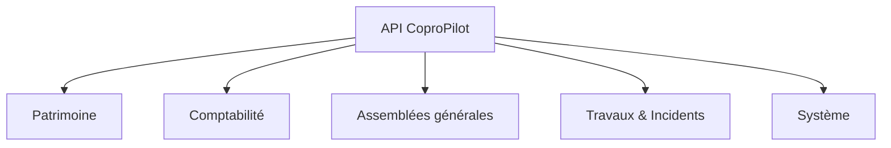

# Référence API

Ce document répertorie tous les points d'accès de l'API (Interface de Programmation Applicative) de CoproPilot. Toutes les requêtes sont préfixées par `/api`.

## Structure de l'API

L'API est organisée en cinq groupes correspondant aux modules fonctionnels de la plateforme.

## Conventions REST

L'API suit les conventions REST (Representational State Transfer) :

- **GET** — Consulter une ou plusieurs ressources.
- **POST** — Créer une nouvelle ressource.
- **PUT** — Modifier une ressource existante.
- **DELETE** — Supprimer une ressource.

Toutes les routes (sauf santé) nécessitent une authentification préalable.

---

## Système

| Action | Méthode | Chemin |
|---|---|---|
| Vérifier l'état du serveur | GET | `/api/health` |
| Récupérer les statistiques du tableau de bord | GET | `/api/stats/dashboard` |

---

## Patrimoine — Copropriétés

| Action | Méthode | Chemin |
|---|---|---|
| Lister toutes les copropriétés | GET | `/api/coproprietes` |
| Consulter une copropriété | GET | `/api/coproprietes/:id` |
| Créer une copropriété | POST | `/api/coproprietes` |
| Modifier une copropriété | PUT | `/api/coproprietes/:id` |
| Supprimer une copropriété | DELETE | `/api/coproprietes/:id` |

## Patrimoine — Lots

| Action | Méthode | Chemin |
|---|---|---|
| Lister les lots d'une copropriété | GET | `/api/lots/copropriete/:coproprieteId` |
| Consulter un lot | GET | `/api/lots/:id` |
| Consulter les clés de répartition d'un lot | GET | `/api/lots/:id/cles-repartition` |
| Créer un lot | POST | `/api/lots` |
| Modifier un lot | PUT | `/api/lots/:id` |
| Supprimer un lot | DELETE | `/api/lots/:id` |

## Patrimoine — Copropriétaires

| Action | Méthode | Chemin |
|---|---|---|
| Rechercher des copropriétaires | GET | `/api/coproprietaires/search` |
| Lister tous les copropriétaires | GET | `/api/coproprietaires` |
| Consulter un copropriétaire | GET | `/api/coproprietaires/:id` |
| Créer un copropriétaire | POST | `/api/coproprietaires` |
| Modifier un copropriétaire | PUT | `/api/coproprietaires/:id` |
| Supprimer un copropriétaire | DELETE | `/api/coproprietaires/:id` |

## Patrimoine — Parties communes

| Action | Méthode | Chemin |
|---|---|---|
| Lister les parties communes d'une copropriété | GET | `/api/parties-communes/copropriete/:coproprieteId` |
| Consulter une partie commune | GET | `/api/parties-communes/:id` |
| Créer une partie commune | POST | `/api/parties-communes` |
| Modifier une partie commune | PUT | `/api/parties-communes/:id` |
| Supprimer une partie commune | DELETE | `/api/parties-communes/:id` |

## Patrimoine — Clés de répartition

| Action | Méthode | Chemin |
|---|---|---|
| Lister les clés d'une copropriété | GET | `/api/cles-repartition/copropriete/:coproprieteId` |
| Consulter une clé de répartition | GET | `/api/cles-repartition/:id` |
| Créer une clé de répartition | POST | `/api/cles-repartition` |
| Modifier une clé de répartition | PUT | `/api/cles-repartition/:id` |
| Supprimer une clé de répartition | DELETE | `/api/cles-repartition/:id` |
| Attribuer une clé à un lot | PUT | `/api/cles-repartition/lot/:lotId/cle/:cleId` |
| Retirer une clé d'un lot | DELETE | `/api/cles-repartition/lot/:lotId/cle/:cleId` |

## Patrimoine — Locataires

| Action | Méthode | Chemin |
|---|---|---|
| Lister les locataires d'un lot | GET | `/api/locataires/lot/:lotId` |
| Consulter un locataire | GET | `/api/locataires/:id` |
| Créer un locataire | POST | `/api/locataires` |
| Modifier un locataire | PUT | `/api/locataires/:id` |
| Supprimer un locataire | DELETE | `/api/locataires/:id` |

## Patrimoine — Mutations

| Action | Méthode | Chemin |
|---|---|---|
| Lister les mutations d'un lot | GET | `/api/mutations/lot/:lotId` |
| Enregistrer une mutation | POST | `/api/mutations` |
| Supprimer une mutation | DELETE | `/api/mutations/:id` |

---

## Comptabilité — Budgets prévisionnels

| Action | Méthode | Chemin |
|---|---|---|
| Lister les budgets d'une copropriété | GET | `/api/budgets/copropriete/:coproprieteId` |
| Consulter un budget | GET | `/api/budgets/:id` |
| Consulter les postes d'un budget | GET | `/api/budgets/:id/postes` |
| Créer un budget | POST | `/api/budgets` |
| Créer un poste de dépense | POST | `/api/budgets/postes` |
| Modifier un budget | PUT | `/api/budgets/:id` |
| Modifier un poste de dépense | PUT | `/api/budgets/postes/:posteId` |
| Supprimer un budget | DELETE | `/api/budgets/:id` |
| Supprimer un poste de dépense | DELETE | `/api/budgets/postes/:posteId` |

## Comptabilité — Appels de fonds

| Action | Méthode | Chemin |
|---|---|---|
| Lister les appels d'une copropriété | GET | `/api/appels-fonds/copropriete/:coproprieteId` |
| Consulter un appel de fonds | GET | `/api/appels-fonds/:id` |
| Consulter les lignes d'un appel | GET | `/api/appels-fonds/:id/lignes` |
| Créer un appel de fonds | POST | `/api/appels-fonds` |
| Créer une ligne d'appel | POST | `/api/appels-fonds/lignes` |
| Modifier un appel de fonds | PUT | `/api/appels-fonds/:id` |
| Supprimer un appel de fonds | DELETE | `/api/appels-fonds/:id` |

## Comptabilité — Paiements

| Action | Méthode | Chemin |
|---|---|---|
| Lister les paiements d'un copropriétaire | GET | `/api/paiements/coproprietaire/:coproprietaireId` |
| Lister les paiements d'un appel de fonds | GET | `/api/paiements/appel-fonds/:appelFondsId` |
| Consulter le solde d'un copropriétaire | GET | `/api/paiements/solde/:coproprietaireId` |
| Consulter un paiement | GET | `/api/paiements/:id` |
| Enregistrer un paiement | POST | `/api/paiements` |
| Supprimer un paiement | DELETE | `/api/paiements/:id` |

## Comptabilité — Fonds de travaux

| Action | Méthode | Chemin |
|---|---|---|
| Lister les fonds d'une copropriété | GET | `/api/fonds-travaux/copropriete/:coproprieteId` |
| Consulter un fonds de travaux | GET | `/api/fonds-travaux/:id` |
| Créer un fonds de travaux | POST | `/api/fonds-travaux` |
| Modifier un fonds de travaux | PUT | `/api/fonds-travaux/:id` |
| Supprimer un fonds de travaux | DELETE | `/api/fonds-travaux/:id` |

---

## Assemblées générales

| Action | Méthode | Chemin |
|---|---|---|
| Lister les AG d'une copropriété | GET | `/api/assemblees/copropriete/:coproprieteId` |
| Consulter une AG | GET | `/api/assemblees/:id` |
| Consulter les résolutions d'une AG | GET | `/api/assemblees/:id/resolutions` |
| Consulter les présences d'une AG | GET | `/api/assemblees/:id/presences` |
| Créer une AG | POST | `/api/assemblees` |
| Ajouter une résolution | POST | `/api/assemblees/resolutions` |
| Enregistrer une présence | POST | `/api/assemblees/presences` |
| Modifier une AG | PUT | `/api/assemblees/:id` |
| Modifier une résolution | PUT | `/api/assemblees/resolutions/:resolutionId` |
| Supprimer une AG | DELETE | `/api/assemblees/:id` |
| Supprimer une résolution | DELETE | `/api/assemblees/resolutions/:resolutionId` |

---

## Travaux & Incidents — Incidents

| Action | Méthode | Chemin |
|---|---|---|
| Lister les incidents d'une copropriété | GET | `/api/incidents/copropriete/:coproprieteId` |
| Consulter un incident | GET | `/api/incidents/:id` |
| Déclarer un incident | POST | `/api/incidents` |
| Modifier un incident | PUT | `/api/incidents/:id` |
| Supprimer un incident | DELETE | `/api/incidents/:id` |

## Travaux & Incidents — Interventions

| Action | Méthode | Chemin |
|---|---|---|
| Lister les interventions d'une copropriété | GET | `/api/interventions/copropriete/:coproprieteId` |
| Lister les interventions d'un incident | GET | `/api/interventions/incident/:incidentId` |
| Consulter une intervention | GET | `/api/interventions/:id` |
| Créer une intervention | POST | `/api/interventions` |
| Modifier une intervention | PUT | `/api/interventions/:id` |
| Supprimer une intervention | DELETE | `/api/interventions/:id` |

## Travaux & Incidents — Carnet d'entretien

| Action | Méthode | Chemin |
|---|---|---|
| Lister les entrées d'une copropriété | GET | `/api/carnet-entretien/copropriete/:coproprieteId` |
| Consulter une entrée | GET | `/api/carnet-entretien/:id` |
| Créer une entrée | POST | `/api/carnet-entretien` |
| Modifier une entrée | PUT | `/api/carnet-entretien/:id` |
| Supprimer une entrée | DELETE | `/api/carnet-entretien/:id` |
