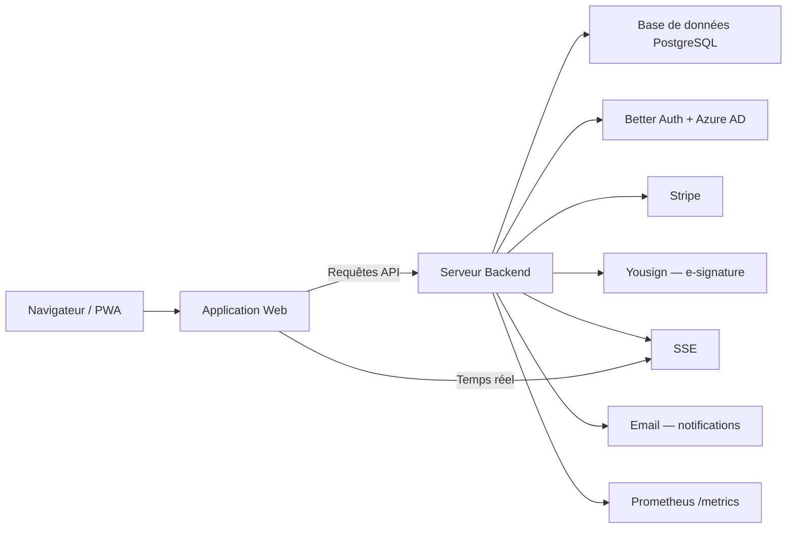
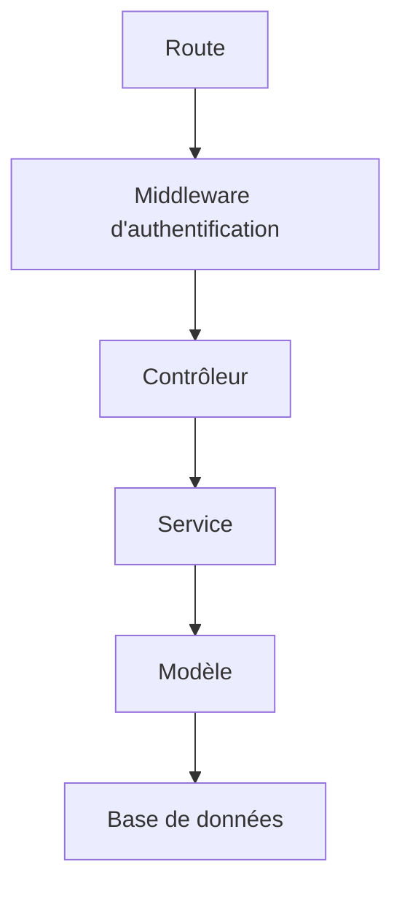
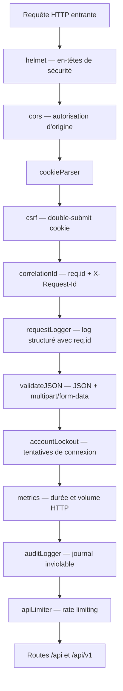
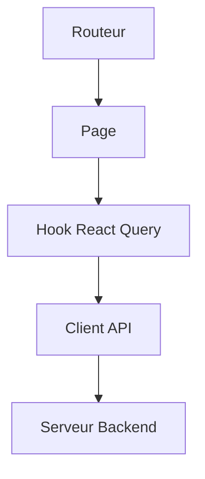
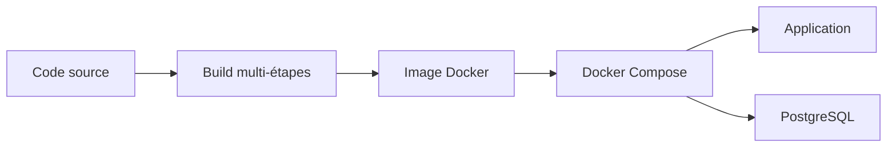

# Architecture technique

Ce document présente l'architecture de CoproPilot et l'interaction entre ses composants.

## Vue d'ensemble

- Le **navigateur** affiche l'application web (interface utilisateur), installable comme PWA.
- L'**application web** envoie des requêtes au serveur backend via une API REST.
- Le **serveur backend** traite la logique métier et communique avec la base de données.
- **PostgreSQL** stocke toutes les données de la plateforme.
- **Better Auth** gère l'authentification (email/mot de passe + Azure AD SSO).
- **SSE** (Server-Sent Events) transmet les notifications en temps réel.
- **Stripe** gère les abonnements SaaS et les paiements en ligne de l'extranet copropriétaire (Checkout).
- **Yousign** fournit la signature électronique des documents (convocations, PV, contrats).
- L'**email** est le canal de diffusion des notifications sortantes (complémentaire des notifications in-app).
- **Prometheus** collecte les métriques applicatives exposées sur `/metrics`.

## Couches du backend

Chaque requête traverse plusieurs couches :

- **Route** — Point d'entrée qui dirige la requête vers le bon contrôleur.
- **Middleware** — Vérifie que l'utilisateur est authentifié avant de continuer.
- **Contrôleur** — Valide les paramètres et formate la réponse.
- **Service** — Contient la logique métier (calculs, règles de gestion).
- **Modèle** — Communique avec la base de données pour lire ou écrire des données.
- **Base de données** — Stocke les informations de manière persistante.

## Pile de middleware Express

Avant d'atteindre les routes, chaque requête HTTP traverse une pile de middleware
globale configurée dans `apps/backend/src/createApp.js`. L'ordre est important
car chaque couche dépend du contexte établi par les précédentes.

Rôle de chaque couche :

- **helmet** — Applique les en-têtes HTTP de sécurité (CSP, HSTS, X-Frame-Options).
- **cors** — Contrôle les origines autorisées (frontend via `BASE_URL`).
- **cookieParser** — Analyse les cookies entrants (prérequis du middleware CSRF).
- **csrf** — Protection CSRF *double-submit cookie* (`apps/backend/src/middleware/csrf.js`) : un token est déposé dans un cookie non HttpOnly et doit être renvoyé dans l'en-tête `X-CSRF-Token` pour les méthodes mutantes.
- **correlationId** — Génère un identifiant unique par requête, exposé via `req.id` et l'en-tête de réponse `X-Request-Id` pour faciliter le traçage distribué.
- **requestLogger** — Log Winston structuré, enrichi avec `req.id` pour corrélation.
- **validateJSON** — Accepte les corps `application/json` et `multipart/form-data` (upload de documents).
- **accountLockout** — Intercepte les tentatives de connexion Better Auth et verrouille temporairement un compte après plusieurs échecs consécutifs.
- **metrics** — Mesure la durée et le volume des requêtes HTTP (histogramme + compteur Prometheus via `prom-client`).
- **auditLogger** — Écrit dans le journal d'audit inviolable (chaîne de hachage SHA-256) les actions sensibles.
- **apiLimiter** — Rate limiting global (fenêtre glissante par IP et par utilisateur).

### Versionnement de l'API

Toutes les routes sont montées simultanément sur deux préfixes :

- `/api` — alias historique (compatibilité ascendante).
- `/api/v1` — version explicite (recommandée pour les nouveaux clients).

Les futures évolutions incompatibles (breaking changes) seront introduites sous
un nouveau préfixe (`/api/v2`) tandis que `/api/v1` restera disponible pour la
période de transition.

## Préoccupations transverses

### Audit inviolable (tamper-proof)

Le journal d'audit (`audit_log`) forme une chaîne cryptographique : chaque
nouvelle entrée stocke un champ `prev_hash` (hash de l'enregistrement précédent)
et un champ `hash` calculé en SHA-256 sur la concaténation
`prev_hash || payload`. Toute altération d'une ligne rompt la chaîne et est
détectée par la méthode `verifyChain()` du service d'audit. Une colonne
`archived` permet de sceller périodiquement les segments anciens.

### Chiffrement des données personnelles (PII)

Les champs sensibles (identifiants bancaires, numéros de sécurité sociale, etc.)
peuvent être chiffrés avec AES-256-GCM via les helpers `maybeEncrypt` et
`maybeDecrypt` exposés par `apps/backend/src/utils/encryption.js`. Le
chiffrement est *opt-in* : seule la clé maître présente dans
`ENCRYPTION_KEY` active la protection, et les modèles choisissent explicitement
quels champs chiffrer à l'écriture et déchiffrer à la lecture.

### Métriques Prometheus

Le middleware `metrics` et le module `prom-client` collectent en continu :

- durée des requêtes HTTP (histogramme par route et code de statut),
- compteur de requêtes par route, méthode et code,
- métriques runtime Node.js par défaut (event loop, mémoire, GC).

Ces métriques sont exposées sur un endpoint dédié `/metrics` (hors préfixe
`/api`) pour scraping par Prometheus.

### Migrations récentes

Les évolutions de schéma récentes sont versionnées sous `apps/backend/migrations/` :

- `20260412000001_add_performance_indexes.js` — index B-tree classiques et
  index GIN *trigram* (`pg_trgm`) pour accélérer les recherches textuelles
  (noms, adresses, références).
- `20260412000002_create_tickets.js` — tables `tickets` et `ticket_messages`
  pour la messagerie syndic ↔ copropriétaire.
- `20260412000003_add_audit_log_hash_chain.js` — colonnes `prev_hash`,
  `hash` et `archived` sur `audit_log` pour matérialiser la chaîne
  cryptographique.
- `20260412000004_add_electronic_voting.js` — tables
  `votes_electroniques` et `procurations` pour le vote électronique en AG.
- `20260412000005_create_signature_requests.js` — tables
  `signature_requests` et `signatories` pour l'intégration Yousign.

## Services métier transverses

Au-delà des services CRUD propres à chaque entité, l'application s'appuie sur
un ensemble de services *transverses* qui orchestrent plusieurs modules :

- **EventDispatchService** — point d'entrée unique pour les événements
  métier. Diffuse (*fan out*) chaque événement vers les canaux de
  notification interne (SSE, centre de notifications) et le service d'email
  sortant.
- **AutoRelanceService** — génère automatiquement les relances en cas de
  paiements en retard, suivant un échéancier configurable, et escalade
  vers le contentieux si nécessaire.
- **ExtranetPaymentService** — intègre Stripe Checkout pour permettre aux
  copropriétaires de régler leurs appels de fonds en ligne depuis l'extranet.
- **VoteElectroniqueService** — orchestre le vote électronique en AG,
  applique les règles de majorité légales (simple, absolue, double majorité,
  unanimité) et tient compte des procurations.
- **ProcurationService** — gère les pouvoirs donnés à un mandataire, avec
  application stricte de la limite légale de **trois mandats** par personne.
- **SignatureRequestService** + **YousignService** — encapsulent l'intégration
  Yousign pour la signature électronique de documents (convocations, PV,
  contrats de syndic).
- **LoiAlurComplianceService** — exécute des contrôles automatiques de
  conformité aux obligations Loi ALUR (fonds de travaux, immatriculation,
  carnet d'entretien, etc.).
- **AgReportService** — produit les cinq annexes comptables obligatoires
  qui accompagnent la convocation à l'AG (état financier, compte de
  gestion, budgets, état des travaux, etc.).
- **TicketService** — gère la messagerie / ticketing bidirectionnelle entre
  le syndic et les copropriétaires (support, réclamations, questions).

## Organisation du frontend

L'interface utilisateur suit ce parcours :

- **Routeur** — Affiche la bonne page selon l'URL (adresse web).
- **Page** — Composant principal qui structure l'affichage.
- **Hook React Query** — Gère le chargement et la mise en cache des données.
- **Client API** — Envoie les requêtes HTTP au serveur backend.
- **Serveur Backend** — Renvoie les données demandées.

### Progressive Web App (PWA)

Le frontend est distribué comme une **Progressive Web App** via
`vite-plugin-pwa`. Le build Vite génère :

- un **manifest** (`manifest.webmanifest`) — nom, icônes, couleur de thème,
- un **service worker** — précache des assets statiques et *runtime caching*
  des appels API (stratégie *network-first* avec repli cache hors ligne).

Cela permet aux syndics d'installer CoproPilot comme une application native
(desktop ou mobile) et de consulter les données récentes même en l'absence
de connexion.

### Code splitting par route

Toutes les pages de `src/pages/` sont chargées en *lazy* via `React.lazy`,
et le routeur (`apps/frontend/src/routes/index.tsx`) encapsule chaque page
dans une frontière `<Suspense>`. Le bundle initial reste léger : seuls
les chunks de la route visitée sont téléchargés, ce qui améliore le *Time
To Interactive* sur les connexions lentes.

### Composants transverses partagés

Le dossier `apps/frontend/src/components/layout/` regroupe les composants
utilisés par l'ensemble des pages :

- **ErrorBoundary** — capture les erreurs React non gérées et enveloppe `<App />`.
- **OfflineIndicator** — bannière réactive à `navigator.onLine`.
- **PwaInstallPrompt** — invite à l'installation de la PWA.
- **Breadcrumbs** — fil d'Ariane construit à partir de la route active.
- **TabBar** — navigation par onglets accessible (ARIA + navigation clavier).
- **ConfirmDialog** — dialogue de confirmation générique.
- **ErrorAlert** — bandeau d'erreur standard.
- **NoCoproprieteSelected** — état vide affiché tant qu'aucune copropriété n'est sélectionnée.

### Composants UI et tableaux de bord

Un composant **DataTable** personnalisé
(`apps/frontend/src/components/ui/data-table.tsx`) fournit tri, recherche,
états de chargement et état vide pour la plupart des listes de l'application.

Le dossier `apps/frontend/src/components/dashboard/` contient les
visualisations du tableau de bord, construites avec **recharts** (barres,
camemberts et courbes pour les indicateurs financiers et opérationnels).

## Déploiement Docker

Le déploiement en production fonctionne ainsi :

- Le **code source** est compilé via un build multi-étapes (frontend puis backend).
- Une **image Docker** unique contient l'application complète.
- **Docker Compose** orchestre deux services : l'application et la base de données.
- En production, le backend sert aussi les fichiers statiques du frontend.

## Environnements disponibles

| Environnement | Adresse | Usage |
|---|---|---|
| Développement frontend | `localhost:3000` | Interface Vite avec proxy /api vers le backend |
| Développement backend | `localhost:3001` | API Express avec redémarrage automatique |
| Production Docker | `localhost:3000` | Application complète conteneurisée |
