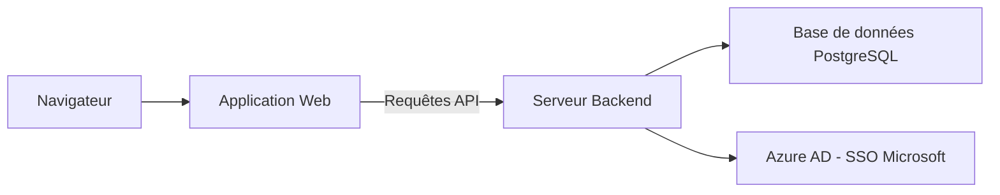
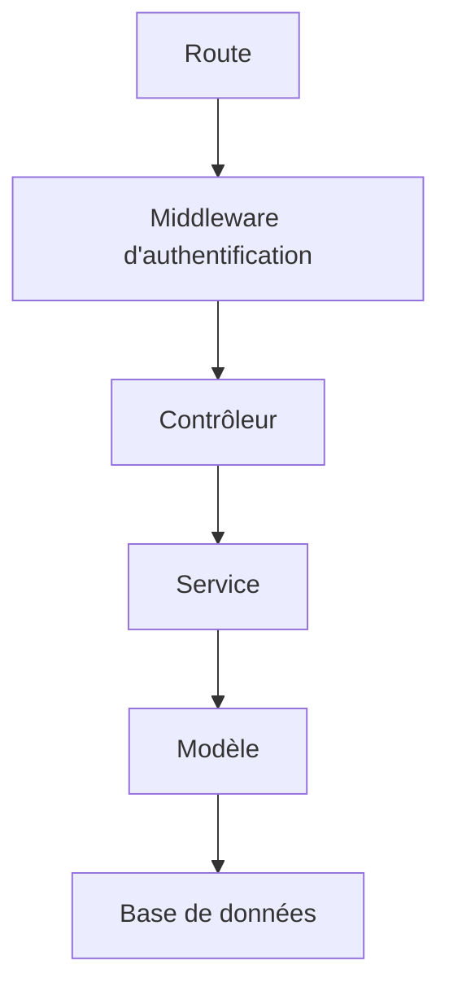
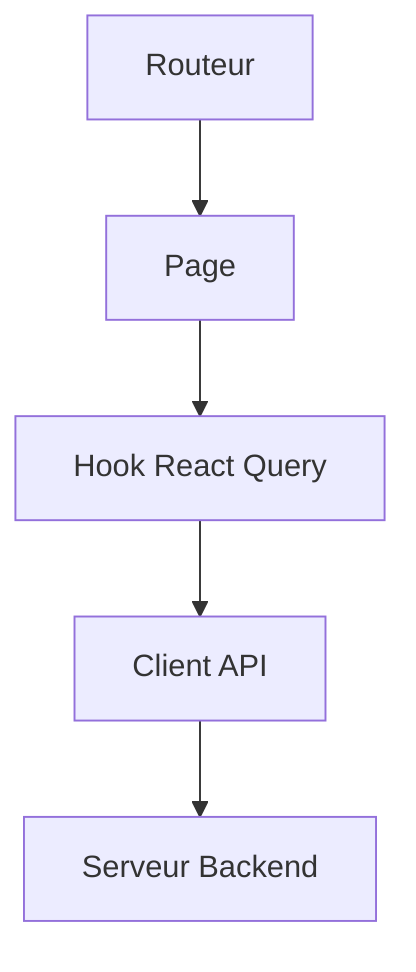
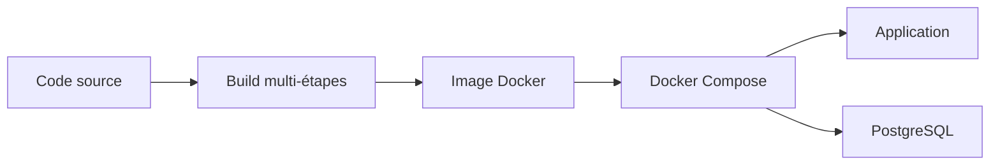

# Architecture technique

Ce document présente l'architecture d'ImmoIA. Il vous permet de comprendre comment les composants de la plateforme interagissent entre eux.

## Vue d'ensemble

- Le **navigateur** affiche l'application web (interface utilisateur).
- L'**application web** envoie des requêtes au serveur backend via une API REST (Interface de Programmation Applicative).
- Le **serveur backend** traite la logique métier et communique avec la base de données.
- **PostgreSQL** stocke toutes les données de la plateforme.
- **Azure AD** (Active Directory) gère l'authentification Microsoft SSO (Single Sign-On).

## Couches du backend

Chaque requête traverse plusieurs couches :

- **Route** — Point d'entrée qui dirige la requête vers le bon contrôleur.
- **Middleware** — Vérifie que l'utilisateur est authentifié avant de continuer.
- **Contrôleur** — Valide les paramètres et formate la réponse.
- **Service** — Contient la logique métier (calculs, règles de gestion).
- **Modèle** — Communique avec la base de données pour lire ou écrire des données.
- **Base de données** — Stocke les informations de manière persistante.

## Organisation du frontend

L'interface utilisateur suit ce parcours :

- **Routeur** — Affiche la bonne page selon l'URL (adresse web).
- **Page** — Composant principal qui structure l'affichage.
- **Hook React Query** — Gère le chargement et la mise en cache des données.
- **Client API** — Envoie les requêtes HTTP au serveur backend.
- **Serveur Backend** — Renvoie les données demandées.

## Déploiement Docker

Le déploiement en production fonctionne ainsi :

- Le **code source** est compilé via un build multi-étapes (frontend puis backend).
- Une **image Docker** unique contient l'application complète.
- **Docker Compose** orchestre deux services : l'application et la base de données.
- En production, le backend sert aussi les fichiers statiques du frontend.

## Environnements disponibles

| Environnement | Adresse | Usage |
|---|---|---|
| Développement frontend | `localhost:5173` | Interface avec rechargement automatique |
| Développement backend | `localhost:3001` | API avec redémarrage automatique |
| Production Docker | `localhost:3000` | Application complète conteneurisée |
