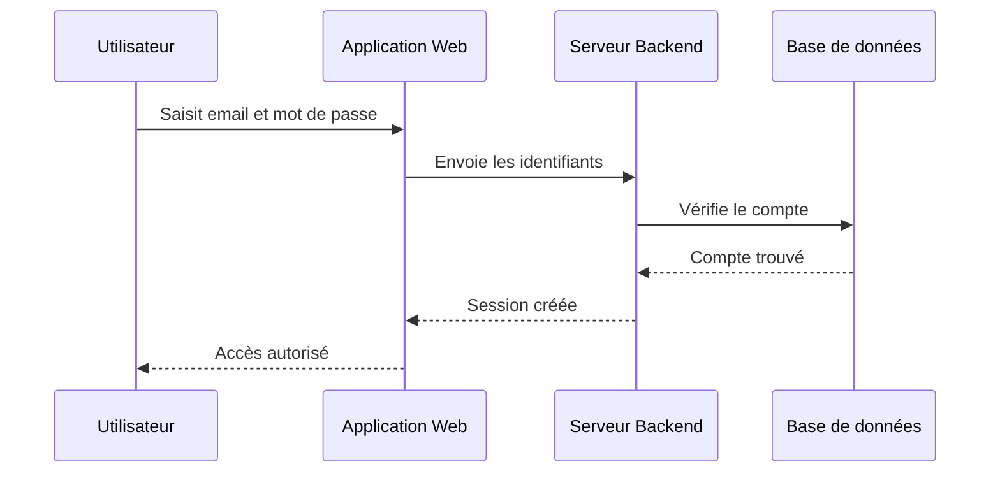
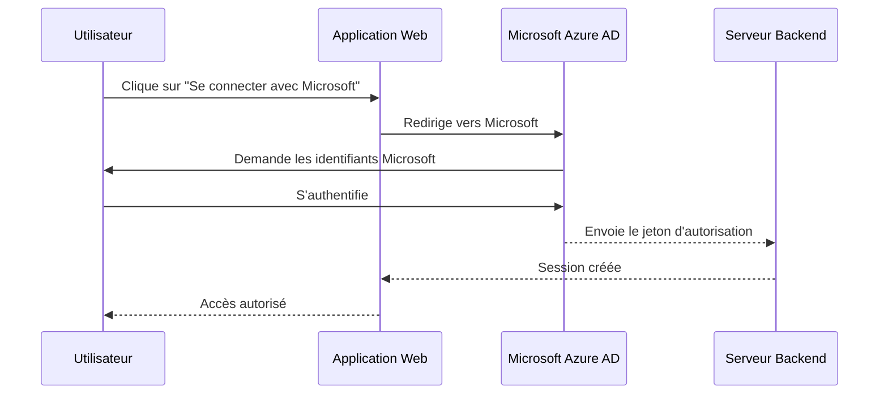
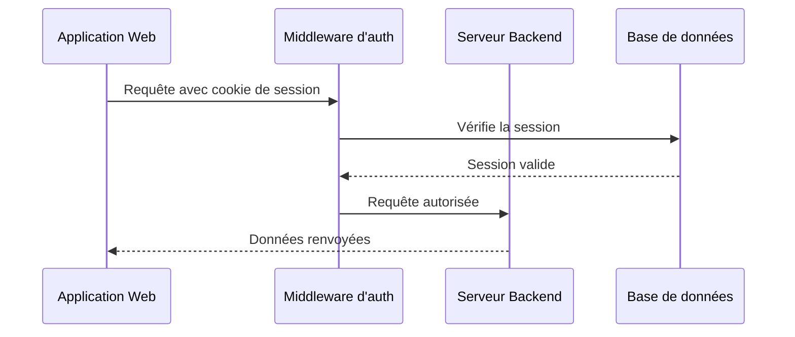

# Authentification et sécurité

Ce document décrit les mécanismes d'authentification et de protection des données de CoproPilot.

## Méthodes de connexion

CoproPilot propose deux méthodes de connexion :

- **Email et mot de passe** — Connexion classique avec un compte créé sur la plateforme.
- **Microsoft SSO** — Connexion via votre compte Microsoft professionnel (Azure AD).

---

## Connexion par email et mot de passe

- L'utilisateur saisit son email et son mot de passe dans le formulaire de connexion.
- L'application envoie les identifiants au serveur backend.
- Le serveur vérifie que le compte existe et que le mot de passe est correct.
- Si la vérification réussit, une session est créée et l'utilisateur accède à la plateforme.

---

## Connexion Microsoft SSO

SSO (Single Sign-On) signifie "authentification unique". Vous utilisez votre compte Microsoft professionnel pour vous connecter.

- L'utilisateur clique sur le bouton de connexion Microsoft.
- L'application redirige vers la page de connexion Microsoft.
- L'utilisateur s'authentifie avec son compte Microsoft professionnel.
- Microsoft envoie un jeton d'autorisation au serveur backend.
- Le serveur crée une session et l'utilisateur accède à la plateforme.

---

## Vérification des requêtes API

Chaque requête envoyée à l'API est vérifiée avant d'être traitée.

- Chaque requête inclut automatiquement un cookie de session.
- Le middleware d'authentification vérifie que la session est valide.
- Si la session est expirée ou absente, la requête est refusée (erreur 401).
- Si la session est valide, la requête est transmise au serveur pour traitement.

---

## Rôles et permissions

Chaque utilisateur possède un rôle qui détermine ses droits d'accès.

| Rôle | Description | Droits |
|---|---|---|
| **admin** | Administrateur de la plateforme | Accès complet à toutes les fonctionnalités |
| **user** | Utilisateur standard | Consultation et gestion des copropriétés assignées |

Les rôles sont définis lors de la création du compte. Seul un administrateur peut modifier le rôle d'un autre utilisateur.

---

## Protection des données

CoproPilot met en place plusieurs mesures de sécurité :

- **CORS** (Cross-Origin Resource Sharing) — Seules les origines autorisées peuvent communiquer avec l'API. Les requêtes provenant d'autres sites sont bloquées.
- **Sessions sécurisées** — Chaque session a une durée de vie limitée. Le jeton de session est stocké dans un cookie sécurisé.
- **Hachage des mots de passe** — Les mots de passe ne sont jamais stockés en clair. Ils sont transformés via un algorithme irréversible avant enregistrement.
- **Validation des données** — Toutes les données reçues par l'API sont validées avant traitement pour prévenir les injections.
- **Origines de confiance** — En développement, les adresses locales sont automatiquement ajoutées aux origines autorisées.
