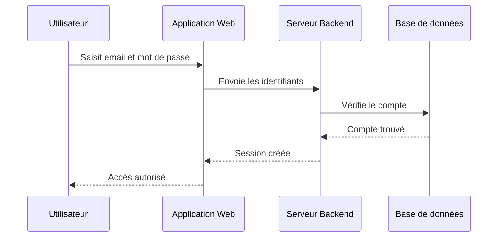
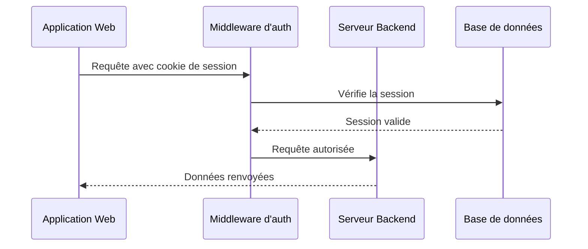
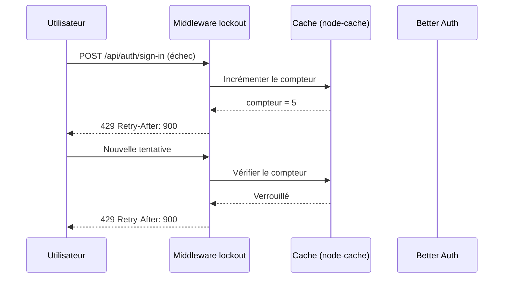
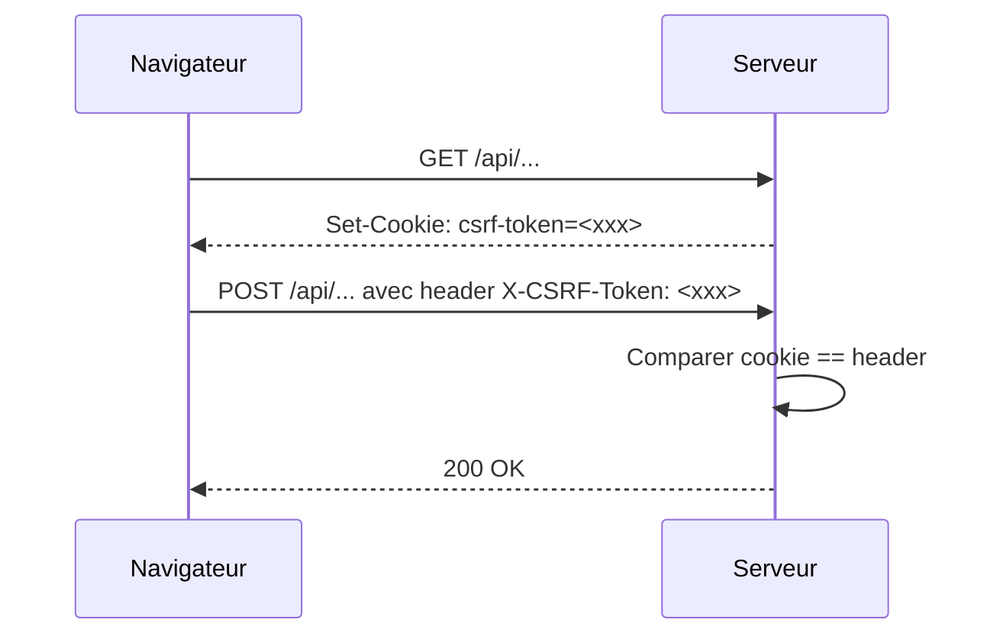

# Authentification et sécurité

Ce document décrit les mécanismes d'authentification et de protection des données de CoproPilot.

## Méthode de connexion

CoproPilot utilise une connexion par **email et mot de passe** avec un compte créé sur la plateforme.

---

## Connexion par email et mot de passe

- L'utilisateur saisit son email et son mot de passe dans le formulaire de connexion.
- L'application envoie les identifiants au serveur backend.
- Le serveur vérifie que le compte existe et que le mot de passe est correct.
- Si la vérification réussit, une session est créée et l'utilisateur accède à la plateforme.

---

## Vérification des requêtes API

Chaque requête envoyée à l'API est vérifiée avant d'être traitée.

- Chaque requête inclut automatiquement un cookie de session.
- Le middleware d'authentification vérifie que la session est valide.
- Si la session est expirée ou absente, la requête est refusée (erreur 401).
- Si la session est valide, la requête est transmise au serveur pour traitement.

---

## Rôles et permissions

Chaque utilisateur possède un rôle qui détermine ses droits d'accès.

| Rôle | Description | Droits |
|---|---|---|
| **admin** | Administrateur de la plateforme | Accès complet à toutes les fonctionnalités |
| **user** | Utilisateur standard | Consultation et gestion des copropriétés assignées |

Les rôles sont définis lors de la création du compte. Seul un administrateur peut modifier le rôle d'un autre utilisateur.

---

## Protection des données

CoproPilot met en place plusieurs mesures de sécurité :

- **CORS** (Cross-Origin Resource Sharing) — Seules les origines autorisées peuvent communiquer avec l'API. Les requêtes provenant d'autres sites sont bloquées.
- **Sessions sécurisées** — Chaque session a une durée de vie limitée. Le jeton de session est stocké dans un cookie sécurisé.
- **Hachage des mots de passe** — Les mots de passe ne sont jamais stockés en clair. Ils sont transformés via un algorithme irréversible avant enregistrement.
- **Validation des données** — Toutes les données reçues par l'API sont validées avant traitement pour prévenir les injections.
- **Origines de confiance** — En développement, les adresses locales sont automatiquement ajoutées aux origines autorisées.

---

## Verrouillage de compte (account lockout)

Pour protéger les comptes contre les attaques par force brute, CoproPilot verrouille temporairement un compte après plusieurs échecs de connexion consécutifs.

| Paramètre | Valeur |
|-----------|--------|
| **Seuil** | 5 tentatives échouées |
| **Fenêtre** | 15 minutes glissantes |
| **Réponse HTTP** | `429 Too Many Requests` avec en-tête `Retry-After` |
| **Stockage** | `node-cache` en mémoire, clé = email + IP |

- Le compteur est réinitialisé après une connexion réussie ou à l'expiration de la fenêtre.
- Le verrou est appliqué **par couple (email, IP)** pour éviter de bloquer un utilisateur légitime depuis un autre poste.
- Les tentatives bloquées ne sont pas transmises à Better Auth : la réponse est renvoyée directement par le middleware.

---

## Corrélation des requêtes (request ID)

Chaque requête HTTP reçoit un identifiant unique utilisé pour la traçabilité dans les logs et pour le débogage côté client.

- **Header** — `X-Request-Id` présent en entrée (réutilisé si fourni par un proxy) et toujours renvoyé dans la réponse.
- **Génération** — UUID v4 si le header n'est pas déjà présent.
- **Logs** — Toutes les entrées Winston sont préfixées par le `requestId`, ce qui permet de retrouver la chaîne complète d'une requête (middleware → controller → service → model → query SQL).
- **Frontend** — En cas d'erreur API, le frontend affiche le `X-Request-Id` dans le toast d'erreur pour faciliter le support.

Voir [`operations.md`](./operations.md) pour l'utilisation des request IDs dans l'analyse des logs de production.

---

## Protection CSRF (Cross-Site Request Forgery)

Les requêtes de modification d'état (POST/PUT/PATCH/DELETE) sont protégées par un mécanisme **double-submit cookie**.

- À la première requête, le serveur fournit un cookie `csrf-token` (HttpOnly=false pour être lisible par le JS).
- Le frontend lit le cookie et le renvoie dans l'en-tête `X-CSRF-Token` de chaque requête mutante.
- Le middleware compare le cookie et le header : s'ils ne correspondent pas, la requête est rejetée avec **403 Forbidden**.

### Routes exemptées

Certaines routes sont exclues de la vérification CSRF car elles ont leur propre mécanisme de vérification :

| Route | Raison |
|-------|--------|
| `/api/auth/*` | Better Auth gère sa propre protection CSRF (origine + SameSite) |
| `/api/stripe/webhook` | Authentification par signature Stripe (`STRIPE_WEBHOOK_SECRET`) |
| `/api/signatures/webhook` | Authentification par signature du prestataire de signature électronique |

Ces exemptions sont déclarées explicitement dans le middleware CSRF et sont auditées à chaque mise à jour.
