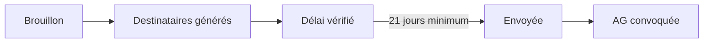
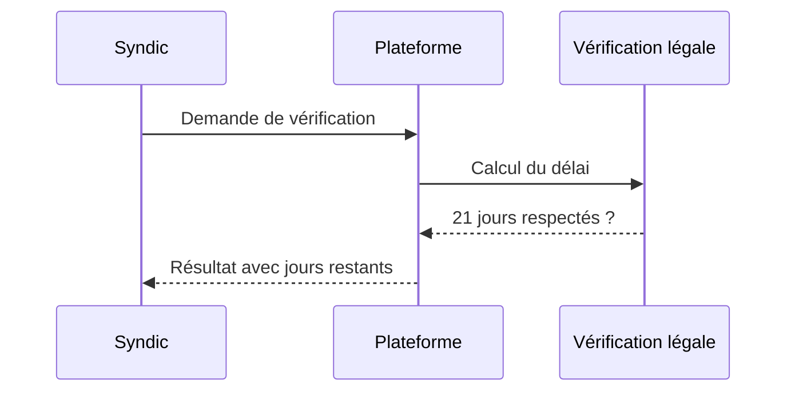
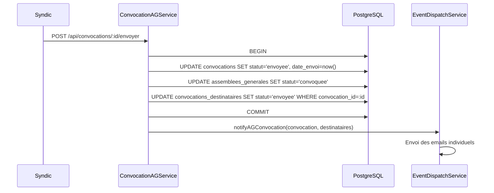

# Convocations d'assemblée générale

Ce document décrit le processus de convocation des copropriétaires à une assemblée générale (AG). Il couvre la création, la génération des destinataires, la vérification du délai légal et l'envoi.

## Vue d'ensemble

La convocation suit un parcours en quatre étapes : rédaction du brouillon, génération de la liste des destinataires, vérification du délai légal de 21 jours, puis envoi.

---

## Étapes du processus

### 1. Créer la convocation

Le syndic crée une convocation rattachée à une AG. Il renseigne :

- **Mode d'envoi** — Email, courrier recommandé ou les deux.
- **Contenu** — Message avec le modèle légal (article 9, décret de 1967).
- **Notes internes** — Commentaires non envoyés aux copropriétaires.

La convocation est créée au statut **brouillon**.

### 2. Générer les destinataires

Le système génère automatiquement la liste des destinataires à partir des copropriétaires possédant des lots dans la copropriété.

- Seuls les **propriétaires** sont inclus (pas les locataires).
- L'email de chaque copropriétaire est **capturé** au moment de la génération (instantané).
- Les doublons sont automatiquement évités.
- Des destinataires peuvent être ajoutés ou retirés manuellement.

### 3. Vérifier le délai légal

La loi impose un délai minimum de **21 jours** entre l'envoi de la convocation et la date de l'AG.

La plateforme affiche :

- **Délai respecté** — Nombre de jours restants avant l'AG.
- **Délai non respecté** — Avertissement si moins de 21 jours.
- **Date limite d'envoi** — Dernier jour possible pour envoyer la convocation.

### 4. Envoyer la convocation

L'envoi met à jour les statuts :

- La convocation passe au statut **envoyée** avec la date du jour.
- L'AG passe au statut **convoquée**.
- Chaque destinataire est marqué comme **envoyé**.

#### Transactionnalité

`ConvocationAGService.envoyerConvocation()` est désormais **atomique**. Les trois mises à jour (convocation, AG, destinataires) sont exécutées dans une **transaction Knex unique** :

- **Un seul batch UPDATE** est désormais utilisé pour les destinataires, au lieu de N mises à jour individuelles (une par destinataire). Cela réduit le nombre d'aller-retours SQL et évite les incohérences en cas d'interruption.
- Si l'une des trois requêtes échoue, **l'intégralité est annulée** (rollback) : la convocation ne passe jamais dans un état partiel.
- Les anciennes colonnes (`date_envoi_destinataire`, `statut_destinataire`) sont mises à jour dans le même batch.

#### Notifications par email

Une fois la transaction **commitée**, le service appelle `EventDispatchService.notifyAGConvocation(convocation, destinataires)` (voir [`domain-events.md`](./domain-events.md) et [`emails.md`](./emails.md)). Le dispatcher :

1. Crée une notification in-app pour chaque destinataire lié à un compte utilisateur.
2. Envoie un **email individuel** à chaque destinataire via Nodemailer, avec le gabarit "Convocation AG + ordre du jour".

Le dispatch est **non bloquant** pour la requête HTTP : si un email ne peut pas être envoyé (erreur SMTP), la convocation reste envoyée en base et l'erreur est loggée avec le `requestId` pour retraitement.

---

## Suivi des destinataires

Chaque destinataire possède un statut individuel :

| Statut | Signification |
|--------|---------------|
| **En attente** | La convocation n'a pas encore été envoyée |
| **Envoyée** | La convocation a été transmise |
| **Reçue** | La réception est confirmée |
| **AR signé** | L'accusé de réception du recommandé est signé |

Pour les envois par courrier recommandé, le syndic peut enregistrer la **date de réception** et la **date de signature de l'AR** pour chaque destinataire.

---

## Données enregistrées

### Convocation

- AG associée, mode d'envoi, statut, date d'envoi.
- Contenu (message), documents annexes, notes internes.

### Destinataire

- Copropriétaire associé, statut individuel.
- Email capturé au moment de la génération.
- Dates d'envoi, de réception et de signature AR.
- Mode d'envoi individuel et notes.

---

## Accès dans l'interface

Les convocations sont gérées depuis la **page de détail d'une AG**, dans l'onglet Convocations. Le syndic peut :

- Créer et modifier une convocation.
- Générer la liste des destinataires.
- Consulter le délai légal.
- Envoyer la convocation.
- Suivre le statut de chaque destinataire.

---

## Points d'accès API

| Action | Méthode | Chemin |
|--------|---------|--------|
| Convocation d'une AG | GET | `/api/convocations/ag/:agId` |
| Vérifier le délai légal | GET | `/api/convocations/delai/:agId` |
| Consulter une convocation | GET | `/api/convocations/:id` |
| Consulter les destinataires | GET | `/api/convocations/:id/destinataires` |
| Créer une convocation | POST | `/api/convocations` |
| Générer les destinataires | POST | `/api/convocations/:id/generer-destinataires` |
| Envoyer la convocation | POST | `/api/convocations/:id/envoyer` |
| Modifier une convocation | PUT | `/api/convocations/:id` |
| Ajouter un destinataire | POST | `/api/convocations/destinataires` |
| Modifier un destinataire | PUT | `/api/convocations/destinataires/:destId` |
| Supprimer une convocation | DELETE | `/api/convocations/:id` |
| Supprimer un destinataire | DELETE | `/api/convocations/destinataires/:destId` |
