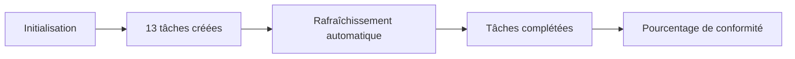
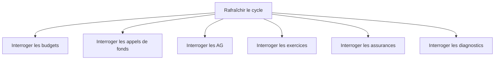

# Cycle annuel du syndic

Ce document décrit le suivi du cycle annuel réglementaire de chaque copropriété. Il permet au syndic de visualiser l'avancement des obligations légales sur l'année en cours.

## Vue d'ensemble

Chaque année, le syndic initialise le cycle annuel pour une copropriété. Le système crée 13 tâches obligatoires et détecte automatiquement lesquelles sont accomplies en interrogeant les données existantes.

---

## Tâches obligatoires

Le cycle annuel comprend **13 tâches** couvrant les obligations financières, juridiques et réglementaires.

### Obligations financières

| Tâche | Description |
|-------|-------------|
| **Budget prévisionnel voté** | Le budget annuel a été voté en AG |
| **Appel de fonds T1** | L'appel du 1er trimestre a été émis |
| **Appel de fonds T2** | L'appel du 2e trimestre a été émis |
| **Appel de fonds T3** | L'appel du 3e trimestre a été émis |
| **Appel de fonds T4** | L'appel du 4e trimestre a été émis |
| **Exercice comptable clôturé** | L'exercice de l'année a été clôturé |
| **Cotisations fonds de travaux** | Les cotisations annuelles ont été appelées (loi ALUR) |

### Obligations juridiques

| Tâche | Description |
|-------|-------------|
| **AG ordinaire tenue** | L'assemblée générale annuelle a eu lieu |
| **Comptes approuvés en AG** | Les comptes ont été approuvés par les copropriétaires |
| **Contrat de syndic valide** | Le mandat du syndic est en cours de validité |

### Obligations réglementaires

| Tâche | Description |
|-------|-------------|
| **Déclaration au registre national** | La déclaration annuelle a été effectuée |
| **Assurance multirisque à jour** | La police d'assurance immeuble est active |
| **Diagnostics obligatoires à jour** | Le DPE et le diagnostic amiante sont valides |

---

## Détection automatique

Le système détecte automatiquement l'accomplissement des tâches en interrogeant les données existantes.

Par exemple :

- **Budget voté** → vérifie si un budget existe avec le statut `voté` ou `approuvé` pour l'année.
- **Appel T1 émis** → vérifie si un appel de fonds du 1er trimestre a le statut `émis` ou `clôturé`.
- **AG tenue** → vérifie si une AG ordinaire a le statut `terminée` pour l'année.
- **Diagnostics à jour** → vérifie la présence d'un DPE et d'un diagnostic amiante valides.

Le rafraîchissement est déclenché manuellement par le syndic via un bouton.

---

## Statuts possibles

Chaque tâche possède l'un des statuts suivants :

| Statut | Signification | Affichage |
|--------|---------------|-----------|
| **En attente** | La tâche n'a pas encore été réalisée | Cercle gris |
| **En cours** | La tâche est en cours de traitement | Horloge jaune |
| **Complétée** | La tâche est accomplie | Coche verte |
| **En retard** | La date d'échéance est dépassée | Alerte rouge |

---

## Indicateur de conformité

Un pourcentage de conformité est calculé : nombre de tâches complétées divisé par le nombre total de tâches.

| Pourcentage | Couleur | Signification |
|-------------|---------|---------------|
| 80 % et plus | Vert | Conformité satisfaisante |
| 50 % à 79 % | Jaune | Conformité partielle |
| 1 % à 49 % | Orange | Conformité insuffisante |
| 0 % | Gris | Aucune tâche accomplie |

Cet indicateur est affiché sur la page de détail de chaque copropriété.

---

## Points d'accès API

| Action | Méthode | Chemin |
|--------|---------|--------|
| Définitions des tâches | GET | `/api/cycle-annuel/definitions` |
| Tâches d'une copropriété | GET | `/api/cycle-annuel/copropriete/:id` |
| Résumé (pourcentage) | GET | `/api/cycle-annuel/copropriete/:id/summary` |
| Initialiser le cycle | POST | `/api/cycle-annuel/copropriete/:id/initialize` |
| Rafraîchir les statuts | POST | `/api/cycle-annuel/copropriete/:id/refresh` |
| Modifier une tâche | PUT | `/api/cycle-annuel/:id` |
