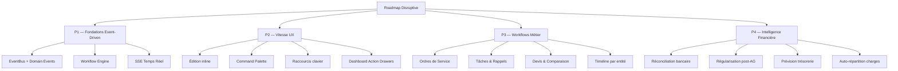
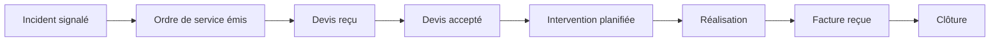
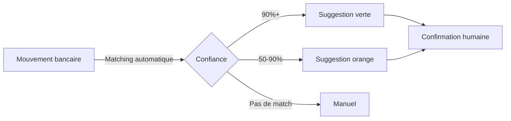

# Roadmap disruptive CoproPilot

Ce document présente la roadmap de transformation de CoproPilot en 4 piliers et 10 sprints. Il s'adresse aux parties prenantes produit et techniques.

> **Date :** 2026-03-21 | **Méthode :** Fast Meeting avec 4 personas IA

## Vision

Passer de **"CRUD moderne pour syndics"** à **"plateforme workflow-driven avec intelligence financière"**.

CoproPilot couvre déjà 58+ routes API et 30+ pages. La couverture fonctionnelle dépasse POWIMO sur plusieurs axes. Le problème n'est pas le manque de features — c'est :

- Des **workflows structurés** qui guident le syndic au lieu de tableaux passifs
- De la **vitesse d'interaction** (moins de clics, moins de navigation)
- De l'**intelligence sur les données existantes** (prédictions, auto-matching)

## Les 4 piliers

## Pilier 1 — Fondations event-driven

**Bénéfice :** Chaque action crée un historique auditable. Nouvelles automatisations sans modifier le code existant.

### 1.1 Domain Events + EventBus

- Table `domain_events` qui enregistre chaque mutation métier
- EventBus en mémoire : persiste l'événement puis dispatche aux handlers
- Timeline gratuite par entité (requête sur `domain_events`)
- Audit trail intégré sans développement supplémentaire
- **Effort :** 1 migration + 1 service + refactoring de 5 services critiques

### 1.2 Workflow Engine (machine à états)

Transitions de statut déclaratives avec guards et effets automatiques :

- Chaque transition peut déclencher des notifications et créer des entités
- Le syndic peut outrepasser les guards (guide, pas cage)
- **Appliquer en priorité à :** Incident, AG, Contentieux

### 1.3 SSE temps réel

- Endpoint `GET /api/sse/stream` — notifications push sans polling
- Le frontend rafraîchit automatiquement les données concernées
- SSE choisi plutôt que WebSocket : unidirectionnel, passe par le proxy Vite, zéro dépendance

## Pilier 2 — Vitesse d'interaction UX

**Bénéfice :** 80% des actions quotidiennes réalisables en 2-3 clics au lieu de 8-12.

### 2.1 Édition inline des tableaux

- Double-clic sur une cellule pour modifier directement
- Mutation optimiste via React Query
- Validation inline via Zod
- **Priorité :** téléphone/email copropriétaire, statut incident, statut paiement
- Conserver les form dialogs uniquement pour la création

### 2.2 Command Palette avec actions

Ajouter des actions au `GlobalSearch` existant :

- "Signaler un incident" → formulaire pré-rempli
- "Changer statut incident X" → modification inline
- "Exporter copropriétaires en CSV" → export immédiat
- Modèle : Superhuman, Linear — `Cmd+K` comme interface principale

### 2.3 Raccourcis clavier

- `n` : créer une nouvelle entité
- `j`/`k` : naviguer dans les lignes
- `e` : éditer la ligne sélectionnée
- `?` : afficher l'aide des raccourcis

### 2.4 Dashboard Action Drawers

Remplacer les liens du dashboard par des panneaux latéraux (Sheet shadcn/ui). Le syndic voit une alerte, clique, et agit directement sans navigation.

### 2.5 Tables virtualisées + actions groupées

- `@tanstack/react-virtual` pour les listes 10K+
- Multi-sélection avec checkbox + actions en masse (email, changement de statut, export)
- Pagination par curseur côté backend

## Pilier 3 — Workflows métier structurés

**Bénéfice :** Chaque processus métier est guidé étape par étape. Le syndic ne peut pas oublier une action.

### 3.1 Ordres de service (workflow GDI)

Gap principal vs POWIMO. C'est le workflow quotidien n°1 du syndic.

- Chaque transition notifie le prestataire et alimente la timeline
- Nouvelle table `ordres_service` liée aux incidents et prestataires

### 3.2 Tâches & rappels cross-module

Auto-génération depuis les données existantes :

- Contrat approchant du préavis → tâche automatique
- Diagnostic expirant → tâche automatique
- AG à J-21 sans convocation → tâche automatique
- Assurance expirant dans 30 jours → tâche automatique

### 3.3 Devis & comparaison

- Vue comparaison côte à côte (max 3 devis)
- Un clic "Accepter" → transition dans la machine à états
- Nouvelle table `devis` liée aux interventions

### 3.4 Timeline par entité

Composant `EntityTimeline` réutilisable sur toutes les pages détail. Requête sur `domain_events` filtrée par entité.

## Pilier 4 — Intelligence financière

**Bénéfice :** Réduire le temps de réconciliation de plusieurs heures à 10 minutes par mois.

### 4.1 Réconciliation bancaire auto-match

- Fuzzy matching : montant ±2%, date ±5 jours, référence substring
- Jamais d'auto-confirmation — toujours un clic humain
- **Cible :** 80% de taux d'auto-match

### 4.2 Régularisation automatique post-AG

Quand une résolution "approbation budget" est adoptée :

- Auto-génération du budget en brouillon avec les montants votés
- Création du calendrier d'appels de fonds pour le nouvel exercice
- Le syndic valide en 1 clic

### 4.3 Prévision de trésorerie

- Score de fiabilité par copropriétaire basé sur l'historique de paiements
- Projection 30/60/90 jours des encaissements vs dépenses
- Minimum 2 exercices complets avant d'afficher des prédictions

### 4.4 Auto-répartition des charges

- Calcul automatique de la quote-part par lot selon la clé de répartition
- Génération des lignes d'appel de fonds individuelles
- Table `repartition_audit` pour la traçabilité légale

## Matrice de priorisation

| Feature | Impact | Effort | Sprint |
|---------|--------|--------|--------|
| Domain Events + EventBus | Fondation | M | S1 |
| SSE Notifications | Élevé | S | S2 |
| Workflow Engine | Fondation | M | S2 |
| Édition inline tableaux | Très élevé | S | S3 |
| Command Palette Actions | Élevé | S | S3 |
| Raccourcis clavier | Moyen | XS | S3 |
| Dashboard Action Drawers | Très élevé | M | S4 |
| Ordres de Service | Très élevé | L | S5 |
| Tâches & Rappels | Très élevé | M | S5 |
| Timeline par entité | Élevé | S | S6 |
| Devis & Comparaison | Élevé | M | S7 |
| Réconciliation bancaire | Très élevé | M | S8 |
| Régularisation post-AG | Élevé | M | S8 |
| Prévision trésorerie | Moyen | M | S9 |
| Auto-répartition charges | Moyen | M | S10 |
| Import POWIMO (CSV) | Critique | L | Parallèle |

## Décisions explicites

- **Couverture CRUD complète :** 30+ pages suffisent, priorité aux workflows
- **SSE plutôt que WebSocket :** push unidirectionnel, zéro dépendance
- **EventEmitter in-process :** pas de message broker (Kafka/RabbitMQ)
- **Machine à états maison :** pas de workflow engine externe (Temporal/n8n)
- **Heuristiques déterministes :** pas de ML tant que les données sont insuffisantes
- **Pas d'app mobile :** le responsive suffit pour l'extranet
- **Pas d'équipements immeuble :** saisie sans valeur workflow (30+ checkboxes POWIMO)

## Métriques de succès

| Métrique | Actuel | Cible post-P2 | Cible post-P4 |
|----------|--------|---------------|---------------|
| Clics pour traiter un incident | ~12 | ~4 | ~2 |
| Temps réconciliation bancaire/mois | Manuel (heures) | 30 min | 10 min |
| Tâches oubliées (échéances manquées) | Non mesuré | -60% | -90% |
| Temps préparation AG | ~2h | ~45 min | ~20 min |
| Pages visitées par action | ~8 | ~3 | ~1 (dashboard) |

---

*Analyse générée par Fast Meeting — 4 personas IA en parallèle, 2026-03-21*
