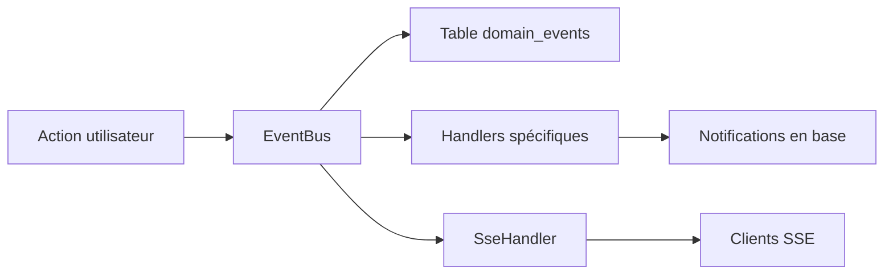
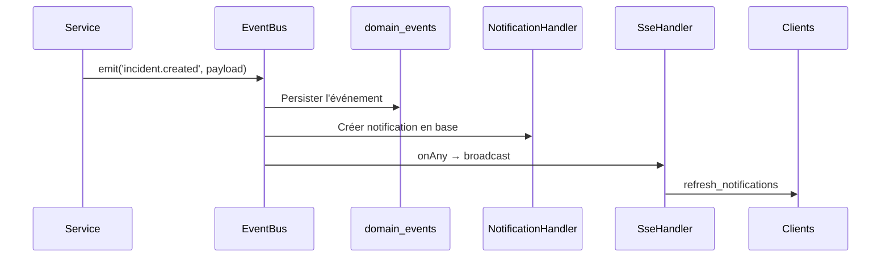
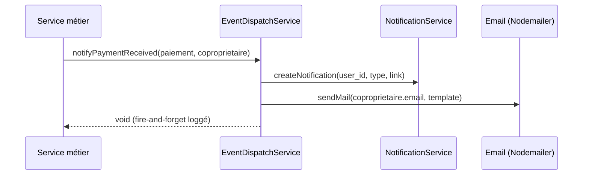

# Événements de domaine

Ce document décrit le système d'événements de domaine (Event Sourcing) et les notifications temps réel de CoproPilot.

## Vue d'ensemble



Chaque action métier émet un événement via l'EventBus. L'événement est d'abord persisté en base, puis dispatché aux handlers enregistrés. Le SseHandler notifie tous les clients connectés en temps réel.

## Types d'événements

| Événement | Entité | Déclencheur |
|-----------|--------|-------------|
| `incident.created` | Incident | Création d'un incident |
| `incident.updated` | Incident | Modification d'un incident |
| `incident.status_changed` | Incident | Changement de statut |
| `intervention.created` | Intervention | Création d'une intervention |
| `intervention.updated` | Intervention | Modification d'une intervention |
| `intervention.status_changed` | Intervention | Changement de statut |
| `assemblee.created` | Assemblée | Création d'une AG |
| `assemblee.updated` | Assemblée | Modification d'une AG |
| `assemblee.status_changed` | Assemblée | Changement de statut |
| `paiement.created` | Paiement | Enregistrement d'un paiement |
| `sinistre.created` | Sinistre | Déclaration d'un sinistre |

## Architecture EventBus



L'EventBus suit le patron **publish/subscribe** :

- **emit(type, data)** — Persiste l'événement puis dispatche aux handlers.
- **on(type, handler)** — Enregistre un handler pour un type d'événement.
- **onAny(handler)** — Enregistre un handler pour tous les événements.

## Handlers de notifications

Le NotificationHandler crée des notifications en base selon l'événement :

| Événement | Destinataires | Lien |
|-----------|--------------|------|
| `incident.created` | Tous les syndics | `/travaux` |
| `paiement.created` | Le copropriétaire concerné | `/extranet` |
| `assemblee.status_changed` (terminée) | Copropriétaires + syndics | `/assemblees/{id}` |
| `intervention.status_changed` (terminée) | Syndics + carnet d'entretien auto | `/travaux` |
| `sinistre.created` | Tous les syndics | `/assurances` |

Quand une intervention est terminée, le handler crée aussi une entrée dans le carnet d'entretien.

## Server-Sent Events (SSE)

Le SseManager gère les connexions temps réel :

- **Endpoint :** `GET /api/sse/stream` (authentification requise)
- **Heartbeat :** toutes les 30 secondes pour maintenir la connexion
- **Reconnexion :** automatique côté client en cas de coupure
- Le SseHandler écoute tous les événements et envoie `refresh_notifications` aux clients

## Timeline

L'endpoint `GET /api/timeline/:entityType/:entityId` retourne l'historique des événements pour une entité donnée, trié par date décroissante.

## Schéma de la table

| Colonne | Type | Description |
|---------|------|-------------|
| `id` | UUID | Identifiant unique (auto-généré) |
| `event_type` | varchar(100) | Type d'événement |
| `entity_type` | varchar(50) | Type d'entité concernée |
| `entity_id` | integer | Identifiant de l'entité |
| `copropriete_id` | integer | Copropriété associée (nullable) |
| `actor_id` | varchar(255) | Utilisateur ayant déclenché l'événement |
| `payload` | JSONB | Données complètes de l'événement |
| `metadata` | JSONB | Métadonnées additionnelles |
| `created_at` | timestamp | Date de création |
| `processed_at` | timestamp | Date de traitement (nullable) |

---

## EventDispatchService — dispatch notifications + emails

Le `EventDispatchService` est une couche de plus haut niveau qui centralise la diffusion des événements métier vers :

1. **Les notifications internes** (table `notifications`, cloche + SSE)
2. **Les emails transactionnels** (voir [`emails.md`](./emails.md))

Cette couche permet aux services métier de déclencher un événement unique sans connaître les canaux de diffusion. Le dispatch est appelé **après la validation des règles métier et après la persistance** dans la transaction principale.

### API

```js
// apps/backend/src/services/EventDispatchService.js
EventDispatchService.notifyPaymentReceived(paiement, coproprietaire)
EventDispatchService.notifyIncidentCreated(incident, copropriete)
EventDispatchService.notifyRelanceSent(relance, coproprietaire)
EventDispatchService.notifyAGConvocation(convocation, destinataires)
EventDispatchService.notifyDocumentAdded(document, copropriete)
```

### Flux



### Déclencheurs

| Méthode | Appelée depuis | Canaux |
|---------|----------------|--------|
| `notifyPaymentReceived` | `PaiementService.create` | notification + email au copropriétaire |
| `notifyIncidentCreated` | `IncidentService.create` | notification aux syndics (pas d'email) |
| `notifyRelanceSent` | `PaiementService` / `RelanceService` | notification + email au copropriétaire |
| `notifyAGConvocation` | `ConvocationAGService.envoyerConvocation` | notification + email à chaque destinataire |
| `notifyDocumentAdded` | `DocumentService` | notification aux utilisateurs de la copropriété |

### Points clés

- Le dispatch est **non bloquant** pour la requête HTTP : les erreurs d'envoi sont loggées mais n'annulent pas l'opération métier.
- Le dispatch est **toujours appelé après commit** de la transaction pour éviter les notifications fantômes en cas de rollback.
- Les envois d'emails sont individuels — pour une AG, un email est envoyé à chaque destinataire séparément (voir [`convocations.md`](./convocations.md)).
- Pour les incidents, seule une notification in-app est créée (pas d'email), afin d'éviter la pollution des boîtes des syndics.
