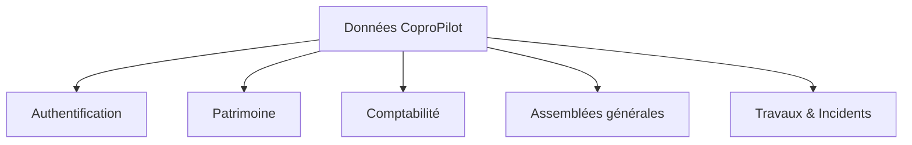
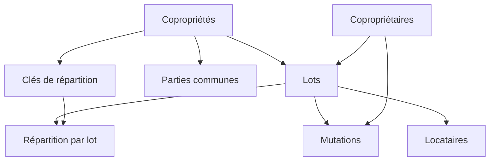
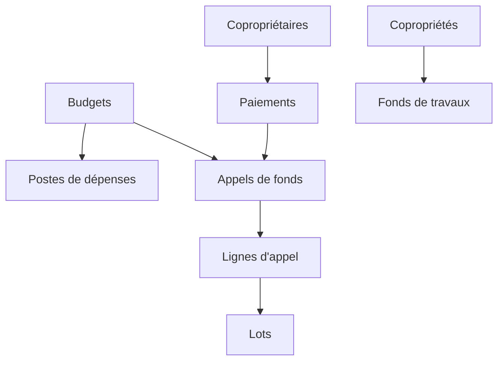
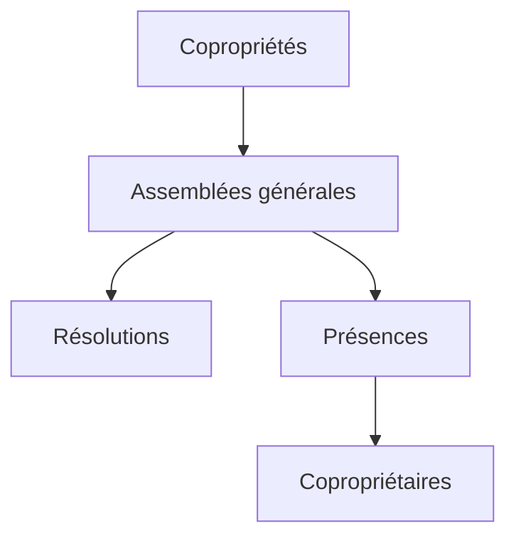
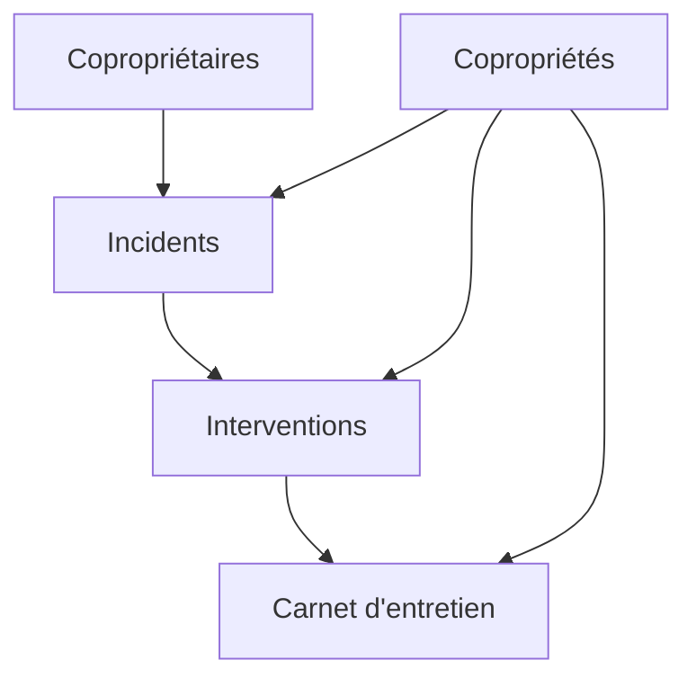

# Schéma des données

Ce document décrit les données stockées par CoproPilot. Chaque table est présentée en langage métier, sans détail technique.

## Organisation des données

Les données sont organisées en cinq groupes correspondant aux modules de la plateforme.

---

## Authentification

Ces tables gèrent les comptes utilisateurs et les connexions.

- **Utilisateur** — Identité de chaque personne ayant accès à la plateforme (nom, email, rôle).
- **Session** — Connexion active d'un utilisateur (durée limitée dans le temps).
- **Compte** — Méthode de connexion (email/mot de passe ou Microsoft SSO).
- **Vérification** — Jeton temporaire pour la validation d'email ou la réinitialisation de mot de passe.

---

## Patrimoine

Ces tables décrivent les immeubles et leurs occupants.

- **Copropriétés** — Fiche de chaque immeuble : nom, adresse, code postal, ville, date de création, nombre de lots, numéro d'immatriculation, lien vers le règlement.
- **Copropriétaires** — Annuaire des propriétaires : nom, prénom, email, téléphone, adresse de correspondance.
- **Lots** — Unités de propriété : numéro, type (appartement, cave, parking, commerce, bureau), surface, étage, tantièmes, copropriété et propriétaire associés.
- **Parties communes** — Espaces partagés : nom, catégorie (générales ou spéciales), copropriété associée.
- **Clés de répartition** — Règles de calcul des charges : nom, description, copropriété associée.
- **Répartition par lot** — Lien entre un lot et une clé de répartition avec la quote-part en tantièmes.
- **Locataires** — Occupants d'un lot : nom, prénom, email, téléphone, dates d'entrée et de sortie.
- **Mutations** — Changements de propriété : lot concerné, ancien et nouveau propriétaire, date, type (vente, donation, succession).

### Relations du patrimoine

- Chaque copropriété contient des lots, des parties communes et des clés de répartition.
- Les lots sont liés aux copropriétaires, aux locataires et aux mutations.
- La répartition par lot fait le lien entre un lot et une clé de répartition.

---

## Comptabilité

Ces tables gèrent le cycle financier.

- **Budgets prévisionnels** — Budget annuel par copropriété : année, montant total, statut (brouillon, voté, approuvé), date de vote.
- **Postes de dépenses** — Lignes d'un budget : nom, catégorie, montant prévu, montant réel, clé de répartition associée.
- **Appels de fonds** — Demandes de paiement trimestrielles : trimestre, année, montant total, dates d'émission et d'échéance, statut (brouillon, émis, clôturé).
- **Lignes d'appel de fonds** — Montant dû par lot pour un appel de fonds donné.
- **Paiements** — Versements des copropriétaires : montant, date, mode (virement, chèque, prélèvement), référence, appel de fonds associé.
- **Fonds de travaux** — Réserve annuelle par copropriété : cotisation annuelle, solde.

### Relations de la comptabilité

- Chaque budget contient des postes de dépenses et peut générer des appels de fonds.
- Les lignes d'appel ventilent le montant par lot.
- Les paiements sont rattachés à un copropriétaire et à un appel de fonds.

---

## Assemblées générales

Ces tables gèrent les réunions de copropriétaires.

- **Assemblées générales** — Réunions : date, heure, lieu, type (ordinaire, extraordinaire), statut, ordre du jour, lien vers le procès-verbal.
- **Résolutions** — Points soumis au vote : numéro, titre, description, majorité requise (article 24, 25, 26, unanimité), résultat (adoptée, rejetée, ajournée), détail des voix.
- **Présences** — Participation de chaque copropriétaire : statut (présent, absent, représenté), représentant éventuel, tantièmes représentés.

### Relations des assemblées

- Chaque copropriété peut avoir plusieurs assemblées générales.
- Chaque assemblée contient des résolutions et une feuille de présence.
- Les présences référencent les copropriétaires.

---

## Travaux & Incidents

Ces tables suivent les problèmes et les interventions.

- **Incidents** — Problèmes signalés : titre, description, catégorie (plomberie, électricité, ascenseur, toiture), niveau d'urgence (faible, moyenne, haute, critique), statut, dates de signalement et de résolution.
- **Interventions** — Actions correctives : prestataire, description, montants (devis et facture), dates (prévue et réalisée), statut, incident associé.
- **Carnet d'entretien** — Historique des travaux : titre, description, prestataire, montant, date de réalisation, catégorie, intervention associée.

### Relations des travaux

- Les incidents sont déclarés sur une copropriété, éventuellement sur un lot précis.
- Les interventions sont liées à un incident et à une copropriété.
- Le carnet d'entretien archive les interventions terminées.

---

## Champs communs

Toutes les tables métier partagent les caractéristiques suivantes :

- **Horodatage automatique** — Chaque enregistrement possède une date de création et de dernière modification.
- **Scope copropriété** — La majorité des données sont rattachées à une copropriété (sauf les copropriétaires qui sont transversaux).
- **Suppression en cascade** — La suppression d'une copropriété entraîne la suppression de toutes ses données associées.
- **Identifiant unique** — Chaque enregistrement possède un identifiant numérique auto-incrémenté.
