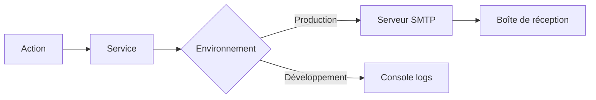

# Système d'emails

Ce document décrit la configuration et les emails transactionnels envoyés par CoproPilot.

## Vue d'ensemble

En production, les emails sont envoyés via SMTP (Nodemailer). En développement, ils sont affichés dans la console pour faciliter le débogage.

## Emails envoyés

| Email | Déclencheur | Destinataire |
|-------|-------------|-------------|
| **Vérification d'email** | Inscription d'un utilisateur | Nouvel utilisateur |
| **Code OTP** | Connexion par code à usage unique | Utilisateur demandeur |
| **Réinitialisation de mot de passe** | Demande de réinitialisation | Utilisateur demandeur |
| **Bienvenue copropriétaire** | Création de compte en masse | Nouveau copropriétaire |
| **Ajout à une copropriété** | Liaison d'un compte existant | Copropriétaire existant |

## Parcours des emails

### Vérification d'email

- Envoyé automatiquement à l'inscription
- Contient un lien de vérification valide **24 heures**
- Connexion automatique après vérification

### Code OTP (One-Time Password)

- Code à **6 chiffres** affiché en grand format
- Valide **15 minutes**
- Utilisé pour la première connexion des copropriétaires

### Réinitialisation de mot de passe

- Lien valide **1 heure**
- Déclenché par l'utilisateur ou par un administrateur

### Bienvenue copropriétaire

- Envoyé lors de la création de comptes en masse par le syndic
- Contient l'adresse email comme identifiant
- Bouton "Activer mon compte" vers la page de première connexion
- L'échec d'envoi ne bloque pas la création du compte

### Ajout à une copropriété

- Envoyé quand un utilisateur existant est lié à une nouvelle copropriété
- Informatif uniquement, aucune action requise

## Configuration SMTP

| Variable | Description | Défaut |
|----------|-------------|--------|
| `SMTP_HOST` | Serveur SMTP | _(requis en production)_ |
| `SMTP_PORT` | Port SMTP | `587` |
| `SMTP_USER` | Identifiant SMTP | _(requis en production)_ |
| `SMTP_PASSWORD` | Mot de passe SMTP | _(requis en production)_ |
| `SMTP_FROM` | Adresse d'expédition | `noreply@copropilot.fr` |

En développement, aucune configuration SMTP n'est nécessaire. Les emails sont affichés dans les logs du serveur.

## Design des emails

Tous les emails partagent un gabarit commun :

- **En-tête :** logo CoproPilot avec dégradé bleu
- **Corps :** texte personnalisé avec bouton d'action
- **Pied de page :** mention "Ne pas répondre" + copyright
- **Largeur :** 560 px maximum, responsive
- **Police :** système (-apple-system, Segoe UI, Roboto)

---

## Envoi événementiel via EventDispatchService

Les emails transactionnels métier ne sont plus envoyés en dur depuis chaque service : ils passent par le `EventDispatchService` (voir [`domain-events.md`](./domain-events.md)).

Quand un service métier déclenche un événement, le dispatcher se charge :

1. De créer la notification in-app (voir [`notifications.md`](./notifications.md)).
2. De construire l'email à partir du gabarit correspondant.
3. D'envoyer l'email via Nodemailer (ou de le logger en développement).

Ce découplage permet d'ajouter un nouveau canal (SMS, webhook tiers...) sans modifier les services métier.

### Matrice des événements et des emails

| Événement | Email envoyé ? | Destinataire | Template |
|-----------|----------------|--------------|----------|
| `payment.received` | Oui | Copropriétaire qui a payé | Confirmation de paiement |
| `relance.sent` | Oui | Copropriétaire en retard | Rappel d'impayé |
| `ag.convocation` | Oui | Chaque destinataire de la convocation | Convocation AG + ordre du jour |
| `incident.created` | **Non** | — | Notification in-app aux syndics uniquement |
| `document.added` | Non (par défaut) | — | Notification in-app |

### Détails par événement

- **Paiement reçu** — Déclenché depuis `PaiementService.create`. L'email récapitule le montant, le mode et l'appel de fonds apuré.
- **Relance envoyée** — Déclenché depuis le workflow de relance. L'email contient le solde dû et le lien vers l'extranet pour payer en ligne.
- **Convocation AG** — Déclenché depuis `ConvocationAGService.envoyerConvocation` **après commit de la transaction**. Un email est envoyé **individuellement** à chaque destinataire (voir [`convocations.md`](./convocations.md)).
- **Incidents** — Créent uniquement une notification in-app visible par les syndics dans la cloche. Aucun email par défaut pour éviter la sur-notification ; un envoi peut être activé manuellement depuis le module incidents si besoin.

### Tolérance aux erreurs

Les envois d'email sont **non bloquants** : une erreur SMTP n'annule pas l'opération métier (paiement enregistré, convocation envoyée, etc.). Les échecs sont loggés avec le `requestId` et le type d'événement pour traitement manuel.
