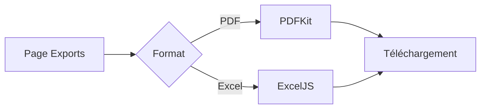

# Exports PDF et Excel

Ce document décrit les documents exportables depuis CoproPilot. Les exports permettent de générer des documents officiels au format PDF et des tableaux de données au format Excel.

## Vue d'ensemble

L'utilisateur accède à la page Exports, sélectionne le document souhaité et lance le téléchargement. Le backend génère le fichier à la volée.

---

## Documents PDF

Cinq documents sont disponibles au format PDF.

| Document | Données | Périmètre |
|----------|---------|-----------|
| **Budget prévisionnel** | Postes de dépenses, montants prévus et réels | Un budget |
| **Appel de fonds** | Montant dû par copropriétaire et par lot | Un appel de fonds |
| **Feuille de présence AG** | Liste des copropriétaires, statut de présence, tantièmes | Une AG |
| **Carnet d'entretien** | Historique des travaux (date, prestataire, montant) | Une copropriété |
| **État des impayés** | Solde de chaque copropriétaire (dû, payé, restant) | Une copropriété |

### Mise en forme

- Format **A4** avec en-tête contenant le nom de la copropriété.
- Montants en **euros** au format français (ex : 1 250,00 EUR).
- Dates au format **jj/mm/aaaa**.
- Saut de page automatique pour les tableaux longs.
- Pied de page avec la date de génération.

---

## Documents Excel

Quatre documents sont disponibles au format Excel (.xlsx).

| Document | Données | Périmètre |
|----------|---------|-----------|
| **Liste des copropriétaires** | Nom, prénom, email, téléphone, adresse | Une copropriété (ou toutes) |
| **Balance des comptes** | Total dû, total payé, solde par copropriétaire | Une copropriété |
| **État des charges** | Postes, montants prévus et réels, écart | Un budget |
| **État des impayés** | Dû, payé, solde, dernier paiement par copropriétaire | Une copropriété |

### Mise en forme

- **En-tête** sur fond bleu foncé avec texte blanc.
- **Ligne de totaux** sur fond vert clair.
- Filtres automatiques activés sur toutes les colonnes.
- Montants au format `#,##0.00 "EUR"`.
- Largeurs de colonnes optimisées par document.

---

## Accès aux exports

La page Exports (`/#/exports`) regroupe tous les documents disponibles. L'utilisateur :

1. Sélectionne le type de document.
2. Choisit l'entité concernée (budget, AG, copropriété) via un menu déroulant si nécessaire.
3. Clique sur le bouton d'export.
4. Le fichier est téléchargé automatiquement par le navigateur.

Les exports sont accessibles aux rôles **syndic** et **utilisateur**.

---

## Points d'accès API

### PDF

| Document | Chemin |
|----------|--------|
| Budget prévisionnel | `GET /api/exports/budget/:id/pdf` |
| Appel de fonds | `GET /api/exports/appel-fonds/:id/pdf` |
| Feuille de présence | `GET /api/exports/feuille-presence/:id/pdf` |
| Carnet d'entretien | `GET /api/exports/carnet-entretien/:coproprieteId/pdf` |
| État des impayés | `GET /api/exports/etat-impayes/:coproprieteId/pdf` |

### Excel

| Document | Chemin |
|----------|--------|
| Copropriétaires | `GET /api/exports/coproprietaires/excel` |
| Balance des comptes | `GET /api/exports/balance-comptes/:coproprieteId/excel` |
| État des charges | `GET /api/exports/etat-charges/:budgetId/excel` |
| État des impayés | `GET /api/exports/etat-impayes/:coproprieteId/excel` |
