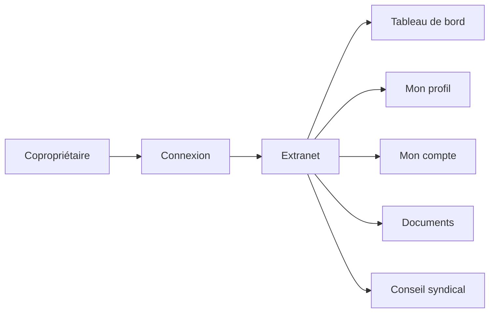

# Extranet copropriétaires

Ce document décrit l'espace extranet réservé aux copropriétaires. Il permet de comprendre les données accessibles, le contrôle d'accès et le parcours utilisateur.

## Vue d'ensemble

L'extranet est une interface en **lecture seule** destinée aux copropriétaires. Chaque utilisateur accède uniquement aux données liées à ses propres lots.

L'extranet propose un tableau de bord personnel, la consultation du profil, du compte financier, des documents et — pour les membres élus — des données du conseil syndical.

---

## Accès et authentification

### Qui peut accéder ?

Seuls les utilisateurs ayant le rôle **copropriétaire** accèdent à l'extranet. Le système vérifie :

1. L'utilisateur est authentifié (session active).
2. Son rôle est `coproprietaire`.
3. Son compte est lié à une fiche copropriétaire (table `coproprietaires.user_id`).

Si l'une de ces conditions n'est pas remplie, l'accès est refusé (erreur 403).

### Sélection de la copropriété

Si le copropriétaire possède des lots dans **plusieurs copropriétés**, un sélecteur lui permet de basculer entre elles. Toutes les données affichées sont filtrées selon la copropriété sélectionnée.

---

## Pages de l'extranet

### Tableau de bord

Vue synthétique de la situation du copropriétaire :

- **Solde du compte** — Montant dû, montant payé, solde.
- **Prochaines AG** — Les 5 prochaines assemblées planifiées ou convoquées.
- **Incidents ouverts** — Les 5 derniers incidents en cours.
- **Notifications non lues** — Nombre d'alertes en attente.
- **Membre du conseil syndical** — Badge affiché si le copropriétaire est élu.

### Mon profil

Informations personnelles et patrimoniales :

- **Coordonnées** — Nom, prénom, email, téléphone, adresse de correspondance.
- **Lots possédés** — Numéro, type, surface, tantièmes pour chaque lot.
- **Copropriétés** — Liste des copropriétés où le copropriétaire possède des lots.

Le copropriétaire peut modifier son **téléphone** et son **adresse de correspondance** (droit de rectification RGPD, article 16).

### Mon compte

Situation financière résumée :

- **Total dû** — Somme de tous les appels de fonds.
- **Total payé** — Somme de tous les paiements enregistrés.
- **Solde** — Différence entre le montant payé et le montant dû.

### Mes charges

Historique des charges sur les **2 dernières années**, ventilé par trimestre.

### Mes appels de fonds

Historique des appels de fonds sur les **3 dernières années** avec date d'émission, date d'échéance, montant et statut.

### Mon fonds de travaux

Quote-part du fonds de travaux calculée **par lot**, en fonction des tantièmes du lot rapportés au total des tantièmes de la copropriété.

### Documents

Espace documentaire filtré par catégories accessibles :

- **Règlements** de copropriété.
- **Diagnostics** techniques (DPE, amiante) avec dates d'expiration.
- **Assurances** actives.
- **Contrats** avec prestataires.
- **Procès-verbaux** des 3 dernières AG terminées.
- **Contrat de syndic** en cours.

### Conseil syndical (accès restreint)

Accessible uniquement aux **membres élus** du conseil syndical. Affiche :

- Liste complète des copropriétaires de la copropriété.
- Soldes financiers de chaque copropriétaire (total dû, payé, solde).
- Soldes des comptes bancaires de la copropriété.

---

## Différences avec l'interface syndic

| Aspect | Extranet (copropriétaire) | Interface syndic |
|--------|--------------------------|------------------|
| **Données** | Personnelles uniquement | Toutes les copropriétés |
| **Écriture** | Lecture seule (sauf profil) | Création, modification, suppression |
| **Pages** | 9 pages légères | 30+ pages de gestion |
| **Finances** | Propre solde et charges | Vue complète de tous les comptes |
| **Documents** | Consultation par catégorie | Gestion complète (téléversement, classement) |
