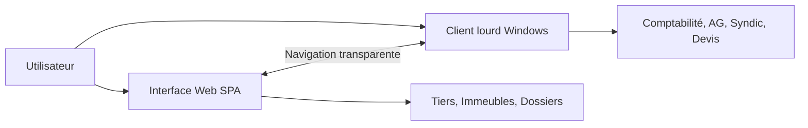
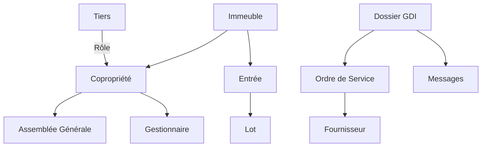
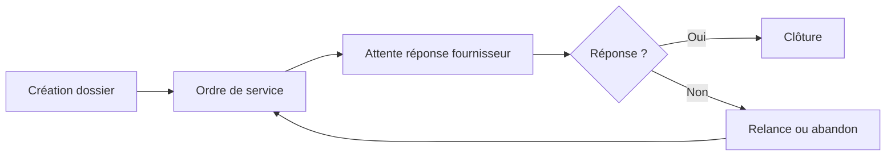
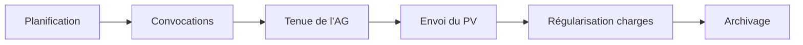
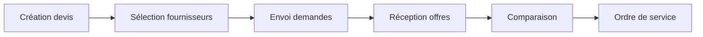
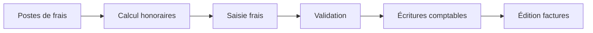

# Base de connaissances — Application legacy POWIMO

Ce document analyse l'application POWIMO (Square Habitat) à partir de 23 captures d'écran de production. Il sert de référence pour la comparaison fonctionnelle avec CoproPilot.

> **Source :** 23 screenshots, 13/03/2026 | **URL :** `https://adb2.squarehabitat.fr`

## Architecture POWIMO

POWIMO combine **deux interfaces** :

- **Interface web moderne** (SPA violet/mauve) — tiers, immeubles, dossiers, documents
- **Client lourd Windows** (Uniface) — comptabilité, AG, devis, module syndic

L'utilisateur navigue entre les deux de manière transparente.

## Modules et navigation

### Barre latérale (interface web)

| Module | Contenu |
|--------|---------|
| **Tableau de bord** | Dossiers récents, tâches, calendrier, rappels |
| **Tiers** | Annuaire 10K+ contacts (copropriétaires, fournisseurs, locataires) |
| **Immeubles** | Patrimoine avec lots, entrées, équipements |
| **Dossiers** | Interventions (GDI), AG, ordres de service |
| **Documents** | GED |
| **Comptes** | Comptabilité (syndic, gérance, mono-propriété) |

### Modules du client lourd

| Module | Contenu |
|--------|---------|
| **Syndic** | Frais, honoraires, factures, annulation |
| **Comptabilité** | Encaissements, factures, OD, rapprochement bancaire |
| **Assemblées Générales** | Historique 10+ ans, convocations, PV, régularisation |
| **Devis** | Saisie structurée, appels d'offres, fournisseurs |
| **Travaux** | Gestion technique |

## Entités et relations

### Entités principales

| Entité | Référence | Description |
|--------|-----------|-------------|
| **Tiers** | TIERS_XXXXX | Tout contact (personne ou entreprise) |
| **Immeuble** | IMME_XX | Bâtiment physique |
| **Copropriété** | CPTE_XXX | Entité juridique |
| **Lot** | Numéro séquentiel | Unité dans un immeuble |
| **Dossier** | GDI_XXXXX / AGE_XXXXX | Suivi d'intervention ou d'AG |
| **Ordre de service** | Référence numérique | Demande à un fournisseur |
| **Devis** | DEV_XXXX | Demande de chiffrage |

### Rôles des tiers

- **Copropriétaire** — propriétaire de lots
- **Locataire** — occupant d'un lot
- **Fournisseur** — prestataire de services
- **Garant** — garant d'un locataire
- **Propriétaire** — en gérance
- **Gestionnaire** — employé du syndic

## Workflows clés

### Gestion d'intervention (GDI)

- Dossier avec titre, description, copropriété et mots-clés
- Émission d'ordres de service avec **montant provisionnel**
- Envoi de messages d'information aux parties prenantes
- Le gestionnaire peut **répondre à la place du fournisseur**
- Statuts : En attente (X/Y) → Clos | Terminé | Abandonné

### Assemblée générale

- Historique complet des AG sur 10+ ans
- Suivi des présences et mandats
- Lien direct AG → comptabilité pour la régularisation

### Devis et appels d'offres

- Saisie structurée avec interlocuteurs et dates limites
- Catégorisation par discipline et sous-discipline
- Sélection fournisseurs : urgence vs amiable

### Comptabilité syndic

## Fonctionnalités détaillées

### Tiers

- Annuaire complet avec 10 000+ contacts et filtrage par type
- Fiche détaillée : coordonnées, adresse, langue
- **Espace Client** : portail web avec gestion des identifiants
- Regroupement de tiers (liens entre personnes, couples)
- Vision multi-copropriété par tiers (soldes, lots, gestionnaires)

### Patrimoine

- Structure hiérarchique : Immeuble → Entrées → Lots
- Lots avec typologie détaillée (type, catégorie, usage, étage)
- Équipements immeuble (30+ types en checkboxes)
- Assurances multiples (multirisque, dommages-ouvrage)
- Dates clés : acquisition, achèvement travaux, réception, conformité
- Adresse IGN et parcelle cadastrale

### Tableau de bord

- Carrousel de dossiers récemment modifiés (cartes avec statut)
- Section tâches avec calendrier mensuel intégré
- Rappels : aujourd'hui, à 5 jours, en retard
- Types de dossiers : GDI (interventions), AG

### Comptabilité

- Comptes par type (Syndic, Gérance, Mono-propriété)
- Filtrage multi-critères et recherches enregistrées
- Soldes avec indication DB/CR (débit/crédit)

## Patterns UI/UX

### Interface web

- **Couleur :** violet/mauve (thème Square Habitat)
- **Cartes horizontales** pour les dossiers récents (carrousel)
- **Badges colorés** pour les statuts (vert = clos, orange = attente, rouge = terminé)
- **Timeline** pour le suivi d'activité
- **Calendrier** intégré au dashboard
- **Bouton CTA** "Démarrer une action" en haut à droite des fiches
- **Personnalisation** des colonnes de tableaux

### Client lourd

- Formulaires denses avec beaucoup de champs par écran
- Onglets multiples (8+ par fiche)
- Menus hiérarchiques numérotés
- Grilles colorées (rouge/vert) pour les AG

## Volumes observés

| Donnée | Volume |
|--------|--------|
| Tiers | 10 000+ |
| Immeubles | 157+ (une agence) |
| Dossiers | Centaines |
| AG par immeuble | ~10 ans d'historique |
| Lots par immeuble | 5+ par entrée |

## Écarts avec CoproPilot

| Fonctionnalité POWIMO | Statut CoproPilot | Priorité |
|-----------------------|-------------------|----------|
| **Ordres de service** (workflow GDI complet) | Absent | Critique |
| **Devis / appels d'offres** | Absent | Élevé |
| **Tâches et rappels** (J, J+5, en retard) | Partiel (cycle annuel) | Élevé |
| **Régularisation charges post-AG** | Absent | Élevé |
| **Répondre à la place du fournisseur** | Absent | Élevé |
| **Recherches enregistrées** | Absent | Moyen |
| **Module Syndic complet** (frais, honoraires) | Absent | Moyen |
| **Tiers regroupés** (liens entre personnes) | Absent | Moyen |
| **Équipements immeuble** (30+ checkboxes) | Absent | Faible |
| **Parcelle cadastrale / IGN** | Absent | Faible |
| **Multi-agence** | Absent | Futur (entreprise) |
| **Personnalisation des colonnes** | Absent | Moyen |
| **Messagerie intégrée** | Absent | Faible |
| Espace client copropriétaire | Présent (extranet) | — |
| Historique AG 10+ ans | Présent | — |
| Messages d'information automatiques | Présent (notifications) | — |

---

*Source : 23 captures d'écran POWIMO (Square Habitat), 13/03/2026*
