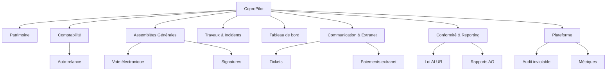
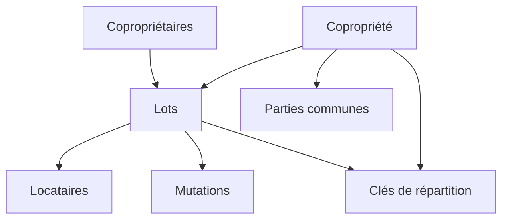
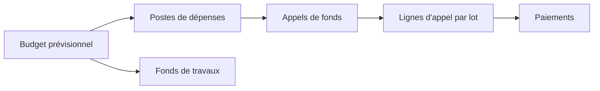
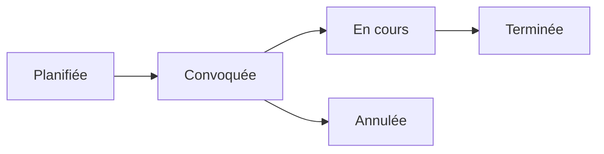
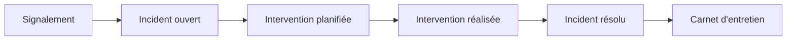

# Guide des modules fonctionnels

Ce document décrit les modules de CoproPilot et leurs fonctionnalités. Chaque module correspond à un domaine métier du syndic de copropriété.

La plateforme compte environ **50 modules backend** (contrôleurs, services et
modèles) regroupés en grands domaines fonctionnels. Les modules *cœur de
métier* sont décrits en détail ci-dessous ; les modules *transverses et
plateforme* sont documentés plus bas.

## Carte des modules

La plateforme se compose de cinq modules métier principaux, complétés par
quatre familles de modules transverses (communication, conformité, plateforme,
automatisation). Chaque module métier est accessible depuis le menu latéral
de l'application.

---

## Module 1-2 — Patrimoine

Ce module regroupe la gestion des immeubles et de leurs occupants.

### Entités gérées

- **Copropriété** — Fiche complète d'un immeuble (adresse, nombre de lots, immatriculation).
- **Lot** — Unité de propriété (appartement, cave, parking) avec surface et tantièmes.
- **Copropriétaire** — Personne physique ou morale détenant un ou plusieurs lots.
- **Partie commune** — Espace partagé (hall, jardin, toiture) classé par catégorie.
- **Clé de répartition** — Règle de calcul pour répartir les charges entre copropriétaires.
- **Locataire** — Occupant d'un lot avec dates d'entrée et de sortie.
- **Mutation** — Historique des changements de propriété (vente, donation, succession).

### Relations entre entités

- Une copropriété contient plusieurs lots, parties communes et clés de répartition.
- Chaque lot appartient à un copropriétaire et peut accueillir un locataire.
- Les mutations enregistrent les transferts de propriété d'un lot.

---

## Module 3 — Comptabilité & Charges

Ce module gère le cycle financier de la copropriété.

### Entités gérées

- **Budget prévisionnel** — Estimation annuelle des dépenses par copropriété.
- **Poste de dépense** — Ligne budgétaire rattachée à un budget (entretien, assurance, personnel).
- **Appel de fonds** — Demande trimestrielle de paiement envoyée aux copropriétaires.
- **Ligne d'appel** — Montant dû par lot pour un appel de fonds donné.
- **Paiement** — Versement effectué par un copropriétaire.
- **Fonds de travaux** — Réserve financière annuelle obligatoire (loi ALUR).

### Flux comptable

- Le budget prévisionnel définit les dépenses annuelles.
- Les postes détaillent chaque catégorie de dépense.
- Les appels de fonds sont émis chaque trimestre.
- Les paiements sont enregistrés par copropriétaire.
- Le fonds de travaux est alimenté indépendamment.

---

## Module 4 — Assemblées Générales

Ce module couvre l'organisation des AG (Assemblées Générales) de copropriété.

### Entités gérées

- **Assemblée générale** — Réunion des copropriétaires (date, lieu, type, ordre du jour).
- **Résolution** — Point soumis au vote avec majorité requise et résultat.
- **Présence** — Statut de chaque copropriétaire (présent, absent, représenté).

### Cycle de vie d'une AG

- L'AG est d'abord **planifiée** avec une date et un lieu.
- Elle est ensuite **convoquée** avec envoi de l'ordre du jour.
- Le jour J, elle passe **en cours** avec prise de présences et votes.
- Elle est **terminée** une fois le procès-verbal établi.
- Elle peut être **annulée** avant sa tenue.

---

## Module 5 — Travaux & Incidents

Ce module permet le suivi des problèmes et des interventions sur les immeubles.

### Entités gérées

- **Incident** — Problème signalé (fuite, panne, dégradation) avec niveau d'urgence.
- **Intervention** — Action corrective planifiée avec prestataire et coût.
- **Carnet d'entretien** — Historique des travaux réalisés sur la copropriété.

### Flux de traitement d'un incident

- Un copropriétaire **signale** un problème.
- L'incident est enregistré comme **ouvert** avec un niveau d'urgence.
- Une **intervention** est planifiée avec un prestataire.
- Une fois les travaux terminés, l'incident passe en **résolu**.
- L'intervention est archivée dans le **carnet d'entretien**.

---

## Tableau de bord

Le tableau de bord offre une vue synthétique de l'activité du parc immobilier.

### Indicateurs affichés

- **Nombre de copropriétés** — Total des immeubles en gestion.
- **Nombre de lots** — Total des lots sur l'ensemble du parc.
- **Nombre de copropriétaires** — Total des personnes enregistrées.
- **Incidents ouverts** — Nombre de problèmes en attente de résolution.

### Widgets

- **Incidents récents** — Liste des derniers incidents signalés.
- **Prochaines AG** — Liste des assemblées générales à venir.
