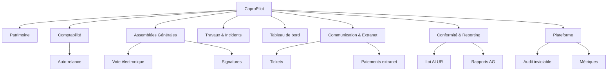
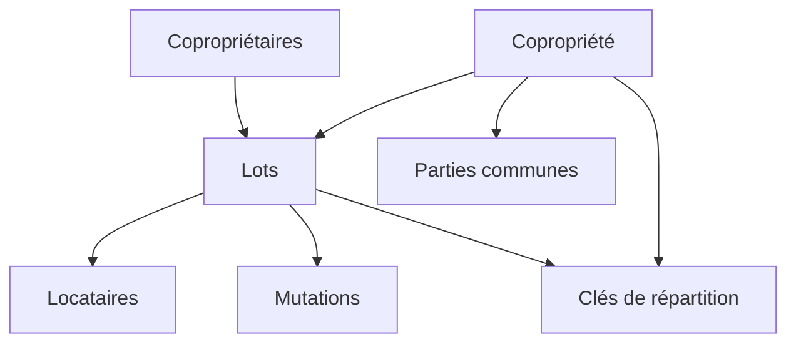
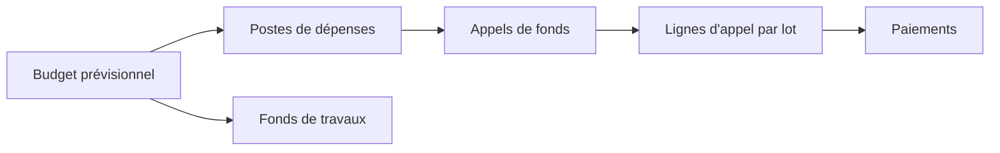
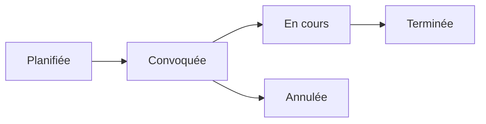
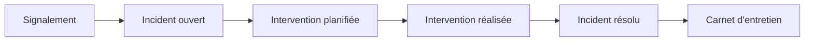
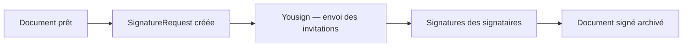

# Guide des modules fonctionnels

Ce document décrit les modules de CoproPilot et leurs fonctionnalités. Chaque module correspond à un domaine métier du syndic de copropriété.

La plateforme compte environ **50 modules backend** (contrôleurs, services et
modèles) regroupés en grands domaines fonctionnels. Les modules *cœur de
métier* sont décrits en détail ci-dessous ; les modules *transverses et
plateforme* sont documentés plus bas.

## Carte des modules

La plateforme se compose de cinq modules métier principaux, complétés par
quatre familles de modules transverses (communication, conformité, plateforme,
automatisation). Chaque module métier est accessible depuis le menu latéral
de l'application.

---

## Module 1-2 — Patrimoine

Ce module regroupe la gestion des immeubles et de leurs occupants.

### Entités gérées

- **Copropriété** — Fiche complète d'un immeuble (adresse, nombre de lots, immatriculation).
- **Lot** — Unité de propriété (appartement, cave, parking) avec surface et tantièmes.
- **Copropriétaire** — Personne physique ou morale détenant un ou plusieurs lots.
- **Partie commune** — Espace partagé (hall, jardin, toiture) classé par catégorie.
- **Clé de répartition** — Règle de calcul pour répartir les charges entre copropriétaires.
- **Locataire** — Occupant d'un lot avec dates d'entrée et de sortie.
- **Mutation** — Historique des changements de propriété (vente, donation, succession).

### Relations entre entités

- Une copropriété contient plusieurs lots, parties communes et clés de répartition.
- Chaque lot appartient à un copropriétaire et peut accueillir un locataire.
- Les mutations enregistrent les transferts de propriété d'un lot.

---

## Module 3 — Comptabilité & Charges

Ce module gère le cycle financier de la copropriété.

### Entités gérées

- **Budget prévisionnel** — Estimation annuelle des dépenses par copropriété.
- **Poste de dépense** — Ligne budgétaire rattachée à un budget (entretien, assurance, personnel).
- **Appel de fonds** — Demande trimestrielle de paiement envoyée aux copropriétaires.
- **Ligne d'appel** — Montant dû par lot pour un appel de fonds donné.
- **Paiement** — Versement effectué par un copropriétaire.
- **Fonds de travaux** — Réserve financière annuelle obligatoire (loi ALUR).

### Flux comptable

- Le budget prévisionnel définit les dépenses annuelles.
- Les postes détaillent chaque catégorie de dépense.
- Les appels de fonds sont émis chaque trimestre.
- Les paiements sont enregistrés par copropriétaire.
- Le fonds de travaux est alimenté indépendamment.

---

## Module 4 — Assemblées Générales

Ce module couvre l'organisation des AG (Assemblées Générales) de copropriété.

### Entités gérées

- **Assemblée générale** — Réunion des copropriétaires (date, lieu, type, ordre du jour).
- **Résolution** — Point soumis au vote avec majorité requise et résultat.
- **Présence** — Statut de chaque copropriétaire (présent, absent, représenté).

### Cycle de vie d'une AG

- L'AG est d'abord **planifiée** avec une date et un lieu.
- Elle est ensuite **convoquée** avec envoi de l'ordre du jour.
- Le jour J, elle passe **en cours** avec prise de présences et votes.
- Elle est **terminée** une fois le procès-verbal établi.
- Elle peut être **annulée** avant sa tenue.

---

## Module 5 — Travaux & Incidents

Ce module permet le suivi des problèmes et des interventions sur les immeubles.

### Entités gérées

- **Incident** — Problème signalé (fuite, panne, dégradation) avec niveau d'urgence.
- **Intervention** — Action corrective planifiée avec prestataire et coût.
- **Carnet d'entretien** — Historique des travaux réalisés sur la copropriété.

### Flux de traitement d'un incident

- Un copropriétaire **signale** un problème.
- L'incident est enregistré comme **ouvert** avec un niveau d'urgence.
- Une **intervention** est planifiée avec un prestataire.
- Une fois les travaux terminés, l'incident passe en **résolu**.
- L'intervention est archivée dans le **carnet d'entretien**.

---

## Tableau de bord

Le tableau de bord offre une vue synthétique de l'activité du parc immobilier.

### Indicateurs affichés

- **Nombre de copropriétés** — Total des immeubles en gestion.
- **Nombre de lots** — Total des lots sur l'ensemble du parc.
- **Nombre de copropriétaires** — Total des personnes enregistrées.
- **Incidents ouverts** — Nombre de problèmes en attente de résolution.

### Widgets

- **Incidents récents** — Liste des derniers incidents signalés.
- **Prochaines AG** — Liste des assemblées générales à venir.

---

## Modules transverses et plateforme

Les modules suivants complètent le cœur métier. Ils sont soit exposés dans
l'interface utilisateur (communication, extranet, conformité), soit
purement techniques (audit, métriques, automatisation).

---

## Module — Tickets

Messagerie et ticketing bidirectionnels entre le syndic et les
copropriétaires (support, réclamations, questions administratives).

### Entités gérées

- **Ticket** — Fil de discussion lié à une copropriété, avec statut
  (ouvert, en cours, résolu, fermé), priorité et catégorie.
- **TicketMessage** — Message individuel rattaché à un ticket, avec
  auteur et horodatage.

### Cycle de vie

- Backend : `TicketController`, `TicketService`, modèles `Ticket` et
  `TicketMessage` ; tables créées par la migration
  `20260412000002_create_tickets.js`.
- Frontend : pages et composants de la section *tickets* pour la vue
  syndic et la vue copropriétaire (extranet).

---

## Module — Vote électronique

Ce module permet le vote à distance ou en séance lors des assemblées
générales, avec prise en compte des pouvoirs (procurations) et
application automatique des règles de majorité.

### Entités gérées

- **VoteElectronique** — Bulletin de vote signé et horodaté,
  rattaché à une résolution d'AG.
- **Procuration** — Mandat donné par un copropriétaire à un mandataire,
  avec limite légale stricte de **trois mandats** par personne.

### Règles de majorité

- Majorité simple (art. 24).
- Majorité absolue (art. 25).
- Double majorité (art. 26).
- Unanimité.

Le service `VoteElectroniqueService` applique automatiquement la bonne
règle selon la résolution et agrège les voix reçues (présentiel +
distanciel + procurations) via `ProcurationService`.

Tables créées par la migration `20260412000004_add_electronic_voting.js`.

---

## Module — Signatures électroniques

Intégration de la signature électronique pour les documents à valeur
juridique (convocations, procès-verbaux, contrats de syndic, mandats).

### Entités gérées

- **SignatureRequest** — Demande de signature créée pour un document et
  son fournisseur externe (Yousign).
- **Signatory** — Signataire individuel (ordre, statut, date de
  signature, lien de signature).

### Flux

- Services : `SignatureRequestService` (logique métier) et
  `YousignService` (client API Yousign).
- Tables : `signature_requests` et `signatories`
  (migration `20260412000005_create_signature_requests.js`).

---

## Module — Paiements extranet

Permet aux copropriétaires de régler leurs appels de fonds en ligne
depuis l'extranet, via **Stripe Checkout**.

### Fonctionnement

- Le service `ExtranetPaymentService` crée une session Stripe Checkout
  pour un appel de fonds et un copropriétaire donnés.
- Le copropriétaire est redirigé vers l'interface sécurisée Stripe.
- Un webhook confirme le paiement et déclenche l'enregistrement côté
  comptabilité ainsi qu'un événement via `EventDispatchService`.

---

## Module — Loi ALUR (conformité)

Exécute des contrôles automatiques de conformité réglementaire.

### Contrôles effectués

- Présence et alimentation du **fonds de travaux**.
- **Immatriculation** de la copropriété au registre national.
- Mise à jour du **carnet d'entretien**.
- Tenue à jour des documents obligatoires (règlement, état descriptif,
  diagnostic technique global, etc.).

Le service `LoiAlurComplianceService` expose un score de conformité et la
liste des non-conformités par copropriété.

---

## Module — Rapports AG

Produit les **cinq annexes comptables obligatoires** qui accompagnent la
convocation à l'AG et permettent de voter les comptes en connaissance de
cause.

### Annexes générées

1. État financier après répartition.
2. Compte de gestion général.
3. Compte de gestion pour opérations courantes et travaux.
4. État des travaux et dépenses exceptionnelles.
5. État des créances et des dettes.

Service : `AgReportService`. Les rapports sont exportables en PDF et
attachés automatiquement à la convocation électronique.

---

## Module — Auto-relance (contentieux)

Automatisation du cycle de relance des impayés.

### Fonctionnement

- Le service `AutoRelanceService` scrute les appels de fonds dont
  l'échéance est dépassée.
- Il génère des **relances graduées** (relance simple, mise en demeure,
  transfert vers le contentieux) selon un échéancier configurable.
- Chaque relance déclenche un événement diffusé par
  `EventDispatchService` (notification in-app + email).

---

## Module — Audit inviolable (plateforme)

Journal d'audit cryptographique garantissant l'intégrité des actions
sensibles.

### Fonctionnement

- Chaque écriture dans `audit_log` stocke un `prev_hash` (hash de
  l'entrée précédente) et un `hash` calculé en SHA-256 sur
  `prev_hash || payload`.
- La méthode `verifyChain()` du service d'audit détecte toute
  altération (modification, suppression, insertion).
- La colonne `archived` permet de sceller périodiquement les anciens
  segments.

Migration associée : `20260412000003_add_audit_log_hash_chain.js`.

---

## Module — Métriques (plateforme)

Expose les métriques applicatives au format Prometheus.

### Métriques collectées

- Histogramme de durée des requêtes HTTP (par route, méthode, code).
- Compteur de requêtes HTTP.
- Métriques runtime Node.js par défaut (event loop, mémoire, GC).

Les métriques sont exposées sur l'endpoint `/metrics` (hors préfixe
`/api`) via `prom-client`, pour scraping par un serveur Prometheus
externe.
