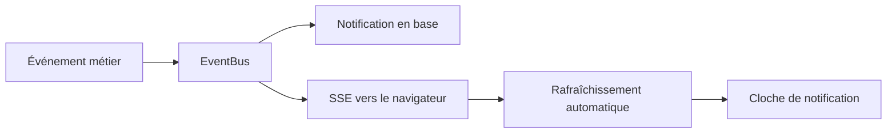
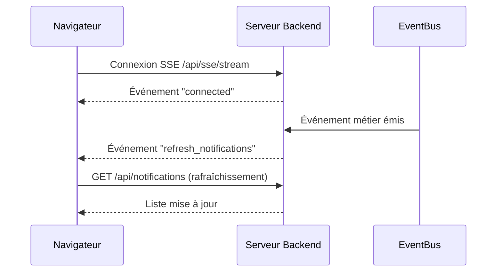

# Notifications et temps réel

Ce document décrit le système de notifications de CoproPilot et la diffusion en temps réel via SSE (Server-Sent Events).

## Vue d'ensemble

Lorsqu'un événement métier se produit (incident, paiement, AG terminée), le système crée une notification en base de données et la pousse en temps réel vers le navigateur via SSE.

---

## Types de notifications

| Type | Déclencheur | Destinataires |
|------|-------------|---------------|
| **incident** | Nouvel incident signalé | Syndics et gestionnaires |
| **paiement** | Paiement enregistré | Copropriétaire concerné |
| **ag** | AG terminée (statut → `terminee`) | Tous les copropriétaires + syndics |
| **document** | Document ajouté | *(prévu, pas encore actif)* |
| **general** | Sinistre déclaré, intervention terminée | Syndics et gestionnaires |

---

## Données d'une notification

Chaque notification contient :

- **Titre** — Résumé court de l'événement.
- **Message** — Détail optionnel (montant, description).
- **Type** — Catégorie (incident, paiement, ag, document, general).
- **Lien** — URL optionnelle vers la page concernée.
- **Lu** — Indicateur de lecture (oui/non).
- **Copropriété** — Copropriété associée (optionnel).

---

## Temps réel (SSE)

### Fonctionnement

- Le navigateur ouvre une **connexion persistante** vers `/api/sse/stream` au chargement de l'application.
- Le serveur envoie un **battement de cœur** toutes les 30 secondes pour maintenir la connexion.
- À chaque événement métier, le serveur envoie un signal `refresh_notifications`.
- Le navigateur rafraîchit automatiquement la liste des notifications via React Query.
- En cas de déconnexion, la reconnexion est automatique après 5 secondes.

### Avantages par rapport au polling

- **Instantanéité** — Les notifications apparaissent immédiatement.
- **Économie de ressources** — Une seule connexion ouverte au lieu de requêtes répétées.
- **Connexions multiples** — Un même utilisateur peut avoir plusieurs onglets ouverts.

---

## Interface utilisateur

### Cloche de notification

Située dans l'en-tête de l'application, la cloche affiche :

- **Badge rouge** avec le nombre de notifications non lues (maximum affiché : 99+).
- **Menu déroulant** avec les 10 dernières notifications.
- **Pastille colorée** par type (rouge pour incident, bleu pour AG, vert pour paiement).
- **Point bleu** sur les notifications non lues.
- **Bouton "Tout marquer comme lu"** en haut du menu.
- **Lien "Voir toutes les notifications"** vers la page dédiée.

### Page notifications

Liste complète de toutes les notifications avec possibilité de :

- Marquer comme lue individuellement.
- Supprimer une notification.
- Naviguer vers la page liée (si un lien existe).

---

## Points d'accès API

| Action | Méthode | Chemin |
|--------|---------|--------|
| Lister les notifications | GET | `/api/notifications` |
| Nombre de non lues | GET | `/api/notifications/unread-count` |
| Marquer comme lue | PUT | `/api/notifications/:id/read` |
| Tout marquer comme lu | PUT | `/api/notifications/read-all` |
| Supprimer | DELETE | `/api/notifications/:id` |
| Flux temps réel | GET | `/api/sse/stream` |

---

## Sécurité — cloisonnement par utilisateur

Un correctif **IDOR** (Insecure Direct Object Reference) a été appliqué : toutes les opérations de lecture/écriture sont désormais scopées à l'utilisateur authentifié.

- `NotificationModel.markAsRead(id, userId)` — vérifie que la notification appartient bien à `userId` avant la mise à jour.
- `NotificationModel.delete(id, userId)` — vérifie que la notification appartient bien à `userId` avant la suppression.
- Les endpoints `PUT /api/notifications/:id/read` et `DELETE /api/notifications/:id` extraient le `userId` de la session et le passent au modèle.
- Un utilisateur qui tente d'accéder à une notification d'un autre compte reçoit une erreur **404** (et non 403, pour ne pas divulguer l'existence de la ressource).

Ce correctif empêche un utilisateur A de marquer comme lue ou de supprimer une notification appartenant à un utilisateur B, même en devinant son identifiant.

---

## Intégration avec les événements de domaine

Les notifications sont désormais **câblées aux événements métier** via le `EventDispatchService` (voir [`domain-events.md`](./domain-events.md)).

Quand un événement est déclenché (paiement reçu, incident créé, relance envoyée, convocation AG, document ajouté), le dispatcher :

1. Crée une entrée dans la table `notifications` avec le bon `user_id`.
2. Émet un signal SSE pour rafraîchir l'interface en temps réel.
3. Déclenche (selon l'événement) un email transactionnel via Nodemailer.

Cela remplace l'ancien système où chaque service créait manuellement ses notifications, et garantit que la logique de diffusion reste centralisée.
