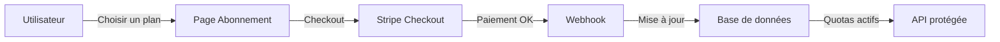
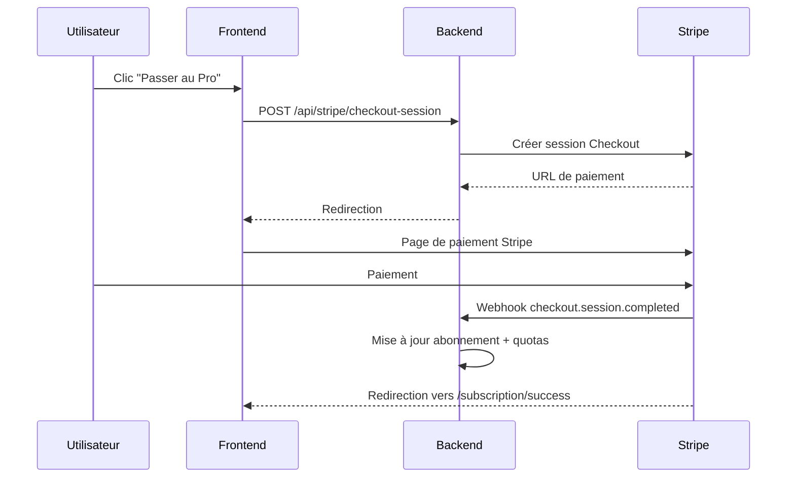

# Intégration Stripe

Ce document décrit le système d'abonnement et de facturation de CoproPilot via Stripe.

## Vue d'ensemble

L'utilisateur choisit un plan depuis la page Abonnement. Stripe gère le paiement. Un webhook synchronise l'état de l'abonnement en base. Les quotas sont ensuite appliqués sur chaque requête API.

## Plans et tarifs

| Plan | Prix | Copropriétés | Utilisateurs | Dépassement |
|------|------|-------------|-------------|-------------|
| **Gratuit** | 0 €/mois | 1 | 3 | Non autorisé |
| **Essentiel** | 9 €/mois | 3 | 5 | Non autorisé |
| **Pro** | 29 €/mois | 20 | 10 | 3 €/copro, 5 €/user |
| **Entreprise** | 99 €/mois | 50 | 25 | 2 €/copro, 4 €/user |

- Les plans **Pro** et **Entreprise** autorisent le dépassement avec facturation à l'usage.
- Le dépassement est reporté via l'API Stripe Billing Meters.

## Fonctionnalités par plan

| Fonctionnalité | Gratuit | Essentiel | Pro | Entreprise |
|---------------|---------|-----------|-----|------------|
| Gestion de base (copropriétés, lots, charges) | Oui | Oui | Oui | Oui |
| Assemblées générales | Non | Oui | Oui | Oui |
| Comptabilité réglementaire | Non | Oui | Oui | Oui |
| Cycle annuel | Non | Non | Oui | Oui |
| Dépassement de quotas | Non | Non | Oui | Oui |

Le middleware `requirePlan()` vérifie le plan minimum requis pour chaque route protégée.

## Parcours utilisateur

Après le paiement, le webhook met à jour la base de données. La page Abonnement affiche le nouveau plan.

## Points d'accès API

| Méthode | Route | Description |
|---------|-------|-------------|
| POST | `/api/stripe/checkout-session` | Créer une session de paiement |
| GET | `/api/stripe/subscription` | Consulter l'abonnement en cours |
| POST | `/api/stripe/portal-session` | Ouvrir le portail client Stripe |
| GET | `/api/stripe/usage` | Consulter l'utilisation et les dépassements |
| POST | `/api/stripe/report-usage` | Reporter l'usage à Stripe (cron/admin) |
| POST | `/api/stripe/webhook` | Recevoir les événements Stripe |

Toutes les routes sauf le webhook nécessitent une authentification.

## Webhooks

| Événement Stripe | Action |
|-----------------|--------|
| `checkout.session.completed` | Créer/mettre à jour l'abonnement, appliquer les quotas |
| `customer.subscription.updated` | Synchroniser le statut et la période |
| `customer.subscription.deleted` | Rétrograder vers le plan gratuit |
| `invoice.upcoming` | Reporter l'usage mesuré avant facturation |
| `invoice.payment_failed` | Marquer l'abonnement comme impayé |

Le webhook vérifie la signature Stripe via `STRIPE_WEBHOOK_SECRET`.

## Contrôle des quotas

Deux middlewares protègent l'API :

- **requireCoproprieteQuota()** — Vérifie le quota de copropriétés lors de la création. Les plans Pro/Entreprise autorisent le dépassement facturé.
- **requirePlan(plan)** — Vérifie que le plan de l'utilisateur est suffisant pour la fonctionnalité demandée.

En mode **self-hosted** (`LICENSING_MODE=self-hosted`), ces middlewares sont désactivés.

## Variables d'environnement

| Variable | Description |
|----------|-------------|
| `STRIPE_SECRET_KEY` | Clé secrète Stripe |
| `STRIPE_PUBLISHABLE_KEY` | Clé publique Stripe (frontend) |
| `STRIPE_WEBHOOK_SECRET` | Secret de vérification des webhooks |
| `STRIPE_PRICE_ESSENTIEL` | ID du prix mensuel Essentiel |
| `STRIPE_PRICE_PRO` | ID du prix mensuel Pro |
| `STRIPE_PRICE_ENTREPRISE` | ID du prix mensuel Entreprise |
| `STRIPE_PRICE_PRO_EXTRA_COPRO` | ID du prix dépassement copropriétés (Pro) |
| `STRIPE_PRICE_PRO_EXTRA_USER` | ID du prix dépassement utilisateurs (Pro) |
| `STRIPE_PRICE_ENTREPRISE_EXTRA_COPRO` | ID du prix dépassement copropriétés (Entreprise) |
| `STRIPE_PRICE_ENTREPRISE_EXTRA_USER` | ID du prix dépassement utilisateurs (Entreprise) |
| `LICENSING_MODE` | `cloud` (quotas actifs) ou `self-hosted` (quotas désactivés) |
