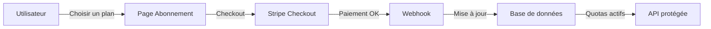
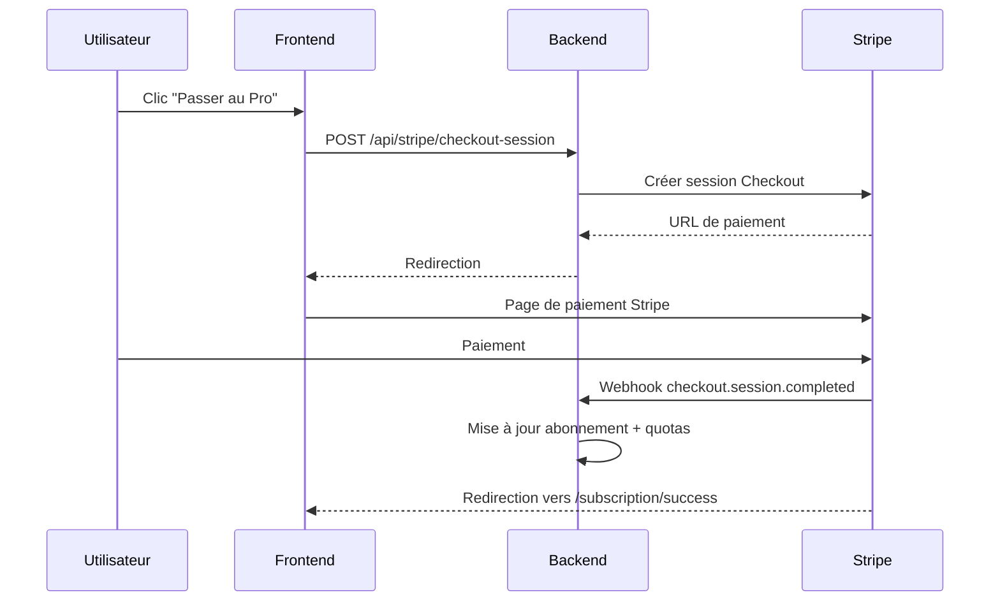
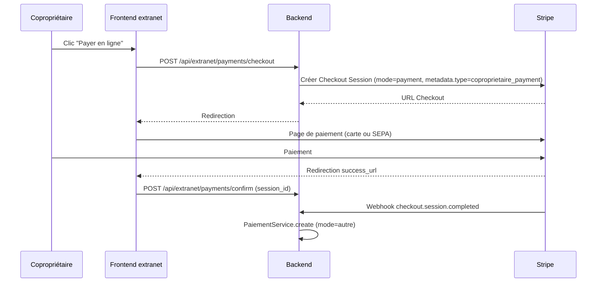

# Intégration Stripe

Ce document décrit le système d'abonnement et de facturation de CoproPilot via Stripe.

## Vue d'ensemble

L'utilisateur choisit un plan depuis la page Abonnement. Stripe gère le paiement. Un webhook synchronise l'état de l'abonnement en base. Les quotas sont ensuite appliqués sur chaque requête API.

## Plans et tarifs

| Plan | Prix | Copropriétés | Utilisateurs | Dépassement |
|------|------|-------------|-------------|-------------|
| **Gratuit** | 0 €/mois | 1 | 3 | Non autorisé |
| **Essentiel** | 19 €/mois | 3 | 5 | Non autorisé |
| **Pro** | 49 €/mois | 20 | 10 | 3 €/copro, 5 €/user |
| **Entreprise** | 149 €/mois | 50 | 25 | 2 €/copro, 4 €/user |

- Les plans **Pro** et **Entreprise** autorisent le dépassement avec facturation à l'usage.
- Le dépassement est reporté via l'API Stripe Billing Meters.

## Fonctionnalités par plan

| Fonctionnalité | Gratuit | Essentiel | Pro | Entreprise |
|---------------|---------|-----------|-----|------------|
| Gestion de base (copropriétés, lots, charges) | Oui | Oui | Oui | Oui |
| Assemblées générales | Non | Oui | Oui | Oui |
| Comptabilité réglementaire | Non | Oui | Oui | Oui |
| Cycle annuel | Non | Non | Oui | Oui |
| Dépassement de quotas | Non | Non | Oui | Oui |

Le middleware `requirePlan()` vérifie le plan minimum requis pour chaque route protégée.

## Parcours utilisateur

Après le paiement, le webhook met à jour la base de données. La page Abonnement affiche le nouveau plan.

## Points d'accès API

| Méthode | Route | Description |
|---------|-------|-------------|
| POST | `/api/stripe/checkout-session` | Créer une session de paiement |
| GET | `/api/stripe/subscription` | Consulter l'abonnement en cours |
| POST | `/api/stripe/portal-session` | Ouvrir le portail client Stripe |
| GET | `/api/stripe/usage` | Consulter l'utilisation et les dépassements |
| POST | `/api/stripe/report-usage` | Reporter l'usage à Stripe (cron/admin) |
| POST | `/api/stripe/webhook` | Recevoir les événements Stripe |

Toutes les routes sauf le webhook nécessitent une authentification.

## Webhooks

| Événement Stripe | Action |
|-----------------|--------|
| `checkout.session.completed` | Aiguillage via `metadata.type` : abonnement SaaS **ou** paiement copropriétaire (voir section dédiée) |
| `customer.subscription.updated` | Synchroniser le statut et la période |
| `customer.subscription.deleted` | Rétrograder vers le plan gratuit |
| `invoice.upcoming` | Reporter l'usage mesuré avant facturation |
| `invoice.payment_failed` | Marquer l'abonnement comme impayé |

Le webhook vérifie la signature Stripe via `STRIPE_WEBHOOK_SECRET`.

## Contrôle des quotas

Deux middlewares protègent l'API :

- **requireCoproprieteQuota()** — Vérifie le quota de copropriétés lors de la création. Les plans Pro/Entreprise autorisent le dépassement facturé.
- **requirePlan(plan)** — Vérifie que le plan de l'utilisateur est suffisant pour la fonctionnalité demandée.

En mode **self-hosted** (`LICENSING_MODE=self-hosted`), ces middlewares sont désactivés.

## Variables d'environnement

| Variable | Description |
|----------|-------------|
| `STRIPE_SECRET_KEY` | Clé secrète Stripe |
| `STRIPE_PUBLISHABLE_KEY` | Clé publique Stripe (frontend) |
| `STRIPE_WEBHOOK_SECRET` | Secret de vérification des webhooks |
| `STRIPE_PRICE_ESSENTIEL_MONTHLY` / `_YEARLY` | IDs des prix Essentiel (mensuel / annuel) |
| `STRIPE_PRICE_PRO_MONTHLY` / `_YEARLY` | IDs des prix Pro (mensuel / annuel) |
| `STRIPE_PRICE_ENTREPRISE_MONTHLY` / `_YEARLY` | IDs des prix Entreprise (mensuel / annuel) |
| `STRIPE_PRICE_PRO_EXTRA_COPRO` | ID du prix dépassement copropriétés (Pro) |
| `STRIPE_PRICE_PRO_EXTRA_USER` | ID du prix dépassement utilisateurs (Pro) |
| `STRIPE_PRICE_ENTREPRISE_EXTRA_COPRO` | ID du prix dépassement copropriétés (Entreprise) |
| `STRIPE_PRICE_ENTREPRISE_EXTRA_USER` | ID du prix dépassement utilisateurs (Entreprise) |
| `LICENSING_MODE` | `cloud` (quotas actifs) ou `self-hosted` (quotas désactivés) |

### Grille tarifaire 2026-07 — migration des prix Stripe

Le 16 juillet 2026, les prix du compte Stripe (9 € / 29 € / 99 €, créés en avril 2026) ont été réalignés sur la grille commerciale affichée par la landing page (19 € / 49 € / 149 €, annuel 144 € / 375 € / 1 140 €). De nouveaux prix ont été créés (les `lookup_key` canoniques `copropilot_<plan>_<cadence>` ont été transférés dessus, et ils sont désormais `default_price` de leurs produits) :

| Plan / cadence | Nouveau price ID | Montant TTC |
|---|---|---|
| Essentiel mensuel | `price_1Ttkz9K2G0vOIqPaNfAIZJ8b` | 19 € |
| Essentiel annuel | `price_1Ttl2ZK2G0vOIqPaDy6j3AVU` | 144 € |
| Pro mensuel | `price_1Ttl2dK2G0vOIqPa7gEGoiab` | 49 € |
| Pro annuel | `price_1Ttl2gK2G0vOIqPa2b1HvwOi` | 375 € |
| Entreprise mensuel | `price_1Ttl2kK2G0vOIqPa8UzQPlWy` | 149 € |
| Entreprise annuel | `price_1Ttl2nK2G0vOIqPa2YKP3O9f` | 1 140 € |

Les prix de dépassement (extra copro / extra utilisateur) sont inchangés et déjà corrects.

**Action requise au déploiement :** mettre à jour les variables `STRIPE_PRICE_*_MONTHLY` / `_YEARLY` de l'environnement de production avec les IDs ci-dessus, puis archiver les anciens prix (`copropilot_*` créés en avril 2026, désormais sans `lookup_key`) dans le dashboard Stripe. Les anciens prix restent actifs tant que les variables ne sont pas à jour afin de ne pas casser le checkout (aucun abonnement actif n'existait au moment de la migration).

---

## Paiements copropriétaires (Coproprietaire Payments)

En plus des abonnements SaaS du syndic, Stripe est également utilisé pour que les **copropriétaires** règlent leurs appels de fonds depuis l'extranet. Cette fonctionnalité réutilise la même intégration Stripe mais via un flux séparé (mode `payment` au lieu de `subscription`).

### Création de la session Checkout

La création passe par `ExtranetPaymentService.createCheckoutSession()` :

- **Mode Stripe** — `payment` (paiement unique, pas d'abonnement).
- **Moyens acceptés** — `card` et `sepa_debit` (prélèvement SEPA européen).
- **Metadata** — `{ coproprietaireId, type: 'coproprietaire_payment' }`. Le champ `type` est indispensable pour que le webhook différencie les flux (voir ci-dessous).
- **URLs de redirection** — `success_url` vers `/#/extranet/compte?payment=success&session_id={CHECKOUT_SESSION_ID}`, `cancel_url` vers `/#/extranet/compte?payment=cancel`.

### Webhook — aiguillage par `metadata.type`

Le handler `StripeService.handleCheckoutCompleted` est désormais un **point d'entrée unique** pour les deux flux. Il inspecte `session.metadata.type` :

| `metadata.type` | Branche empruntée | Action |
|-----------------|-------------------|--------|
| `saas_subscription` (ou absent) | **SaaS** | Création/mise à jour de l'abonnement syndic, application des quotas |
| `coproprietaire_payment` | **Paiement copropriétaire** | Appel `PaiementService.create` avec `mode: 'autre'` |

Le branchement garantit qu'aucun paiement copropriétaire ne déclenche par erreur une modification d'abonnement (et inversement). Les sessions sans `type` sont considérées comme des abonnements SaaS pour compatibilité ascendante.

### Enregistrement du paiement

À la réception du webhook `checkout.session.completed` avec `type: coproprietaire_payment`, le service crée un enregistrement dans la table `paiements` :

- **Copropriétaire** — via `metadata.coproprietaireId`.
- **Montant** — via `session.amount_total` (converti de centimes en euros).
- **Mode** — `autre` (les modes historiques `virement`, `cheque`, `prelevement` étant réservés aux saisies manuelles).
- **Référence** — `session.id` Stripe, permettant de retrouver la transaction.

Le webhook et l'endpoint `/api/extranet/payments/confirm` sont **idempotents** : un même `session.id` ne peut créer qu'un seul paiement (contrainte unique sur la référence). Cela permet au frontend et au webhook Stripe de concourir sans créer de doublon.

Voir [`extranet.md`](./extranet.md) pour le parcours utilisateur complet et le traitement côté copropriétaire.
