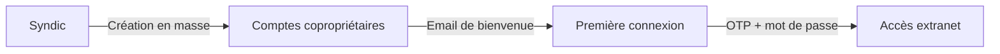
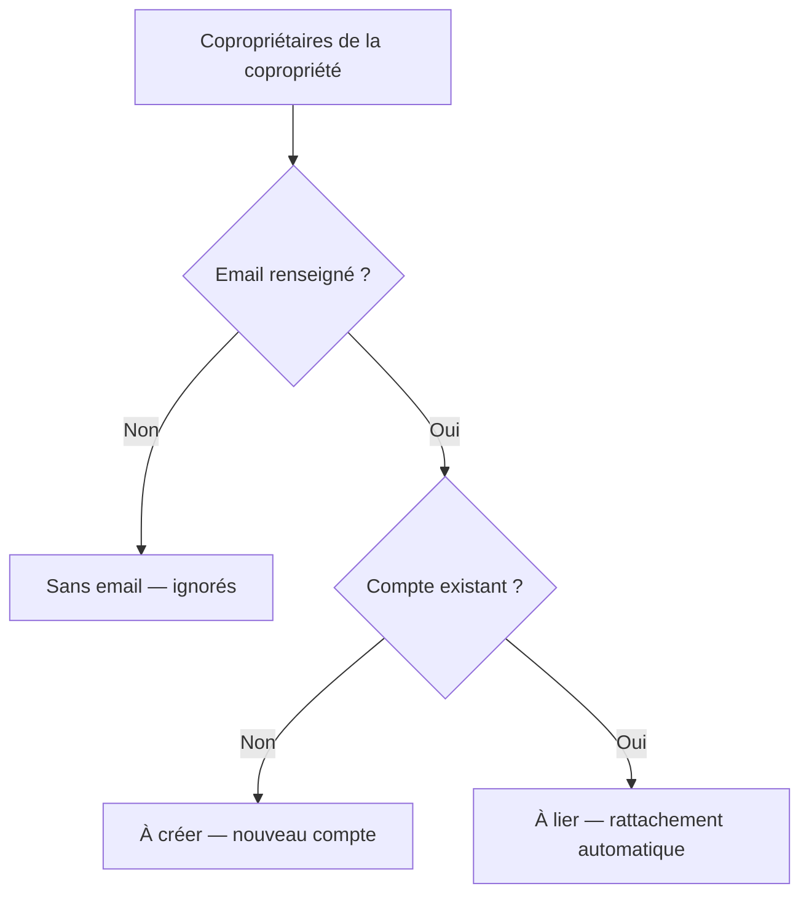
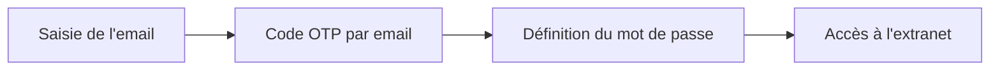

# Gestion des utilisateurs

Ce document décrit la gestion des comptes utilisateurs dans CoproPilot : création individuelle et en masse, première connexion, réinitialisation de mot de passe et rôles.

## Vue d'ensemble

Le syndic crée les comptes des copropriétaires en masse à partir de l'annuaire existant. Chaque copropriétaire reçoit un email de bienvenue et définit son mot de passe lors de sa première connexion.

---

## Rôles

| Rôle | Accès | Gestion des utilisateurs |
|------|-------|--------------------------|
| **admin** | Complet | Peut gérer tous les utilisateurs |
| **syndic** | Gestion des copropriétés | Peut gérer les copropriétaires uniquement |
| **coproprietaire** | Extranet en lecture seule | Aucun |

Un syndic ne peut pas réinitialiser le mot de passe d'un autre syndic ou d'un administrateur.

---

## Création en masse

La création en masse permet de créer les comptes de tous les copropriétaires d'une copropriété en une seule opération.

### Étape 1 — Aperçu

Le système analyse l'annuaire des copropriétaires et les classe en trois catégories :

- **À créer** — Le copropriétaire a un email mais aucun compte n'existe. Un nouveau compte sera créé.
- **À lier** — Un compte existe déjà avec cet email. Le copropriétaire sera rattaché automatiquement.
- **Sans email** — Impossible de créer un compte. Le syndic doit d'abord renseigner l'email.

### Étape 2 — Création

Pour chaque copropriétaire à créer :

1. Un compte est créé avec un **mot de passe temporaire** aléatoire.
2. Le compte est marqué `mustChangePassword = true`.
3. La fiche copropriétaire est liée au compte (`user_id`).
4. Un **email de bienvenue** est envoyé avec un lien vers la première connexion.

Pour chaque copropriétaire à lier :

1. La fiche copropriétaire est rattachée au compte existant.
2. Un **email de notification** informe l'utilisateur de l'ajout.

---

## Première connexion

Le parcours de première connexion guide le copropriétaire en trois étapes.

1. **Email** — Le copropriétaire saisit son adresse email.
2. **Code OTP** — Un code à 6 chiffres est envoyé par email (valable 15 minutes). Le copropriétaire le saisit dans le formulaire.
3. **Mot de passe** — Le copropriétaire définit son mot de passe permanent (12 caractères minimum, règles OWASP).

Après cette étape, le copropriétaire accède directement à l'extranet.

---

## Gestion des mots de passe

### Réinitialisation (syndic ou admin)

Le syndic peut déclencher la réinitialisation du mot de passe d'un copropriétaire depuis la page de gestion des utilisateurs. Un email contenant un lien de réinitialisation est envoyé automatiquement.

### Définition directe (admin uniquement)

L'administrateur peut définir directement un nouveau mot de passe pour un copropriétaire sans passer par l'email.

### Mot de passe oublié (copropriétaire)

Le copropriétaire peut demander lui-même la réinitialisation depuis la page de connexion via le lien "Mot de passe oublié".

---

## Interface de gestion

La page **Gestion des utilisateurs** (`/#/user-management`) affiche :

- **Liste des comptes copropriétaires** avec nom, email, statut de vérification.
- **Copropriétés associées** à chaque utilisateur.
- **Recherche** par nom ou email.
- **Action** de réinitialisation de mot de passe par utilisateur.

---

## Points d'accès API

| Action | Méthode | Chemin |
|--------|---------|--------|
| Lister les utilisateurs | GET | `/api/user-management/coproprietaires` |
| Détails d'un utilisateur | GET | `/api/user-management/coproprietaires/:userId` |
| Aperçu création en masse | GET | `/api/user-management/bulk-preview/:coproprieteId` |
| Créer en masse | POST | `/api/user-management/bulk-create/:coproprieteId` |
| Réinitialiser un mot de passe | POST | `/api/user-management/reset-password` |
| Définir un mot de passe | POST | `/api/user-management/set-password` |
| Définir le mot de passe initial | POST | `/api/user-management/set-initial-password` |
